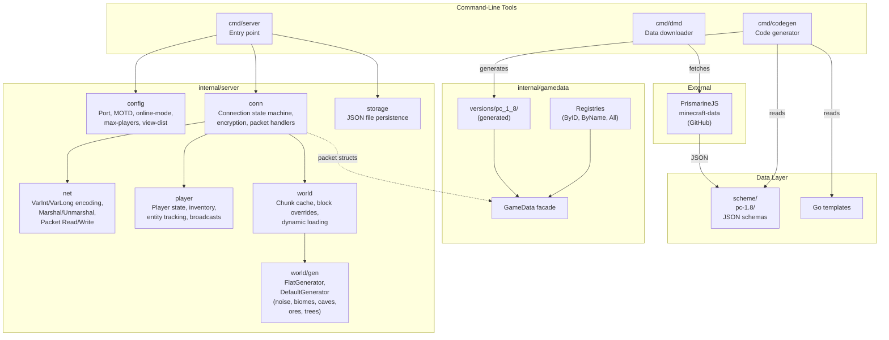
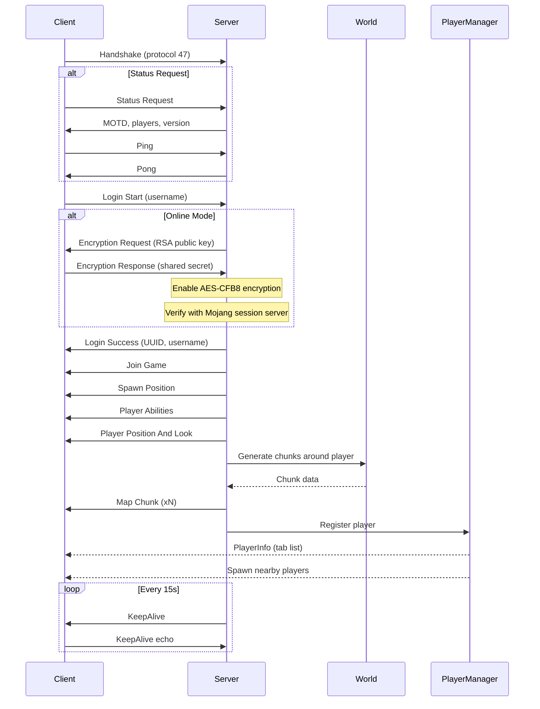
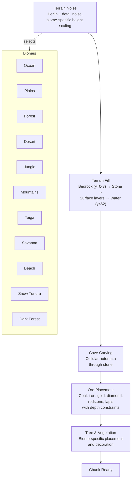
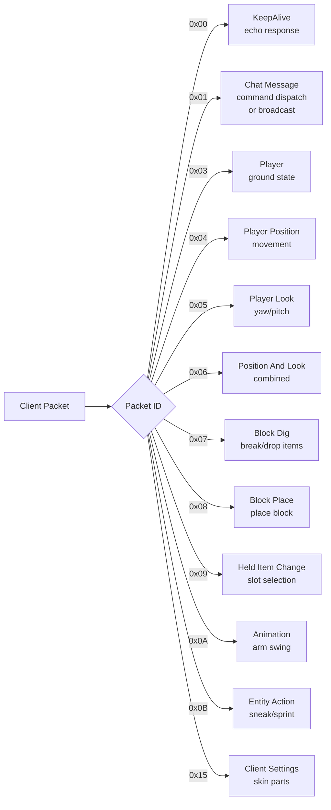

# minecraft-server

A Minecraft 1.8.9 (protocol 47) server implementation in Go.

## Features

- **Offline mode** — UUID v3 login, no encryption
- **Online mode** — RSA/AES-CFB8 encryption, Mojang session authentication
- **Procedural world generation** — Perlin noise terrain with 11 biomes, caves, ores, and trees
- **Flat world generator** — Classic bedrock/stone/grass layers
- **Dynamic chunk loading** — View-distance-based loading/unloading with optional world boundary
- **Block interaction** — Dig and place blocks with broadcast and persistence
- **Multiplayer** — Player spawning, entity tracking, visibility streaming, movement sync
- **Chat & commands** — `/tp`, `/gamemode`, `/time`, `/help`, `/list`, `/say`, `/me`, `/kill`, `/seed`
- **Inventory** — 36-slot hotbar, 4-slot armor, held item switching, item dropping
- **Persistence** — Auto-save world state and player data (position, inventory, gamemode)
- **KeepAlive** — 30-second timeout enforcement
- **Server list** — MOTD, player count, version info
- **Codegen** — Generates Go types from PrismarineJS minecraft-data JSON schemas

## Prerequisites

- [Devbox](https://www.jetify.com/devbox) (provides Go 1.24, gofumpt, golangci-lint, go-task, etc.)

## Getting Started

```bash
git clone git@github.com:OCharnyshevich/minecraft-server.git
cd minecraft-server
direnv allow   # or: devbox shell
```

## Run

```bash
# Offline mode (default)
devbox run -- task server

# Online mode (Mojang authentication)
devbox run -- task server -- -online-mode

# Custom port and MOTD
devbox run -- task server -- -port 25566 -motd "My Server"

# Flat world with a seed
devbox run -- task server -- -generator flat -seed 42

# Limit world radius (in chunks)
devbox run -- task server -- -world-radius 32
```

Connect with a Minecraft 1.8.x client to `localhost:25565`.

### Server Flags

| Flag | Default | Description |
|------|---------|-------------|
| `-port` | 25565 | Server listening port |
| `-online-mode` | false | Enable Mojang authentication + encryption |
| `-motd` | "A Minecraft Server" | Server description |
| `-max-players` | 20 | Max players shown in server list |
| `-view-distance` | 8 | Chunk view distance |
| `-seed` | 0 | World generation seed |
| `-generator` | "default" | World generator: `default` or `flat` |
| `-world-radius` | 0 (infinite) | World boundary in chunks |

## Useful Commands

| Command | Description |
|---------|-------------|
| `devbox run -- task server` | Run the server |
| `devbox run -- task test` | Run all tests with coverage |
| `devbox run -- task fmt` | Format code (gci + gofumpt) |
| `devbox run -- task lint` | Run golangci-lint |
| `devbox run -- task build` | Build binary to `build/app` |
| `devbox run -- task deps` | Download, tidy, and vendor dependencies |
| `devbox run -- task gen:dmd` | Download Minecraft data schemas |
| `devbox run -- task gen:codegen` | Generate Go types from schemas |
| `devbox run -- task cleanup` | Remove build artifacts |

Run a single test:

```bash
devbox run -- go test -mod vendor -run TestName ./path/to/package/...
```

## Architecture

### High-Level Overview



### Connection Lifecycle



### World Generation Pipeline



### Play State Packet Handling



## Project Structure

```
cmd/
  server/          Minecraft server entry point
  dmd/             Minecraft Data Downloader (PrismarineJS fetcher)
  codegen/         Code generator (JSON schemas -> Go types)
internal/
  server/
    config/        Server configuration and CLI flags
    conn/          Connection state machine, encryption, packet handlers, commands
    net/           Protocol I/O (VarInt, packets, marshaling)
    packet/        Packet type definitions (handshake, status, login, play)
    player/        Player state, inventory, entity tracking, broadcasts
    world/         World state, chunk cache, dynamic loading
      gen/         World generators (default, flat, noise, biomes, caves, ores)
    storage/       File persistence (JSON) for world and player data
  gamedata/        Domain types, registries, version loader
    versions/      Generated version-specific data (via codegen)
scheme/            Downloaded Minecraft data JSON files
vendor/            Vendored Go dependencies
```

## Chat Commands

| Command | Description |
|---------|-------------|
| `/help` | List available commands |
| `/list` | Show online players |
| `/tp <player>` | Teleport to a player |
| `/tp <x> <y> <z>` | Teleport to coordinates |
| `/gamemode <mode>` | Switch game mode (survival, creative, adventure, spectator) |
| `/time set <value>` | Set world time (day, night, noon, midnight, or number) |
| `/say <message>` | Broadcast server announcement |
| `/me <action>` | Send action message |
| `/kill` | Respawn player |
| `/seed` | Show world seed |

## Persistence

The server auto-saves every 5 minutes and on shutdown.

```
storage/
├── config.json              # Server config
├── world/
│   └── overrides.json       # Player-made block modifications
└── players/
    ├── <uuid>.json          # Position, gamemode, inventory per player
    └── ...
```

## Protocol Coverage

Minecraft 1.8.8 (protocol 47) implementation status:

| Category | Implemented | Total | Coverage |
|---|---|---|---|
| Handshake | 1 | 1 | 100% |
| Status | 4 | 4 | 100% |
| Login | 4 | 4 | 100% |
| Play (server-bound) | 9 | 26 | 35% |
| Play (client-bound) | 17 | 74 | 23% |
| **Total** | **35** | **109** | **32%** |

### What works

- Full connection lifecycle: handshake, status ping, login (offline + online mode)
- Player movement, look, sneaking, sprinting
- Block dig and place with broadcast to other players
- Chat messaging and commands
- Multiplayer: player spawning, entity tracking, visibility streaming
- Inventory: hotbar, armor, held item, item dropping
- Procedural world generation with biomes, caves, ores, trees
- Dynamic chunk loading/unloading
- World and player data persistence
- KeepAlive with 30s timeout

### What's missing

**Entity Interaction & Combat** — No PvP, no mob combat. Missing: `use_entity`, `entity_equipment`, `entity_velocity`, `entity_metadata`, `entity_effect`, `update_attributes`, `combat_event`, `update_health`.

**World Features** — No day/night, weather, sounds, or particles. Missing: `update_time`, `game_state_change`, `spawn_entity_weather`, `world_border`, `explosion`, `named_sound_effect`, `world_particles`, `world_event`, `block_action`, `block_break_animation`, `map_chunk_bulk`, `tile_entity_data`.

**Mobs & NPCs** — No mob spawning or AI. Missing: `spawn_entity_living`, `spawn_entity`, `spawn_entity_painting`, `spawn_entity_experience_orb`, `attach_entity`, `collect`, `entity_status`.

**Scoreboard & Teams** — Missing: `scoreboard_objective`, `scoreboard_score`, `scoreboard_display_objective`, `scoreboard_team`.

**UI & Misc** — Missing: `tab_complete`, `update_sign`, `title`, `playerlist_header`, `statistics`, `map`, `camera`, `custom_payload`, `resource_pack_send`, `difficulty`.

## Roadmap

1. **Entity interaction** — use_entity, arm animation, equipment display
2. **World ambience** — day/night cycle, weather, sounds, particles
3. **Mob spawning** — living entities, AI, health, combat
4. **Tile entities** — signs, chests, banners
5. **Scoreboard & Teams** — sidebar scores, team colors
6. **Plugin channels** — custom_payload support

## How to Commit

1. Format and lint before committing:
   ```bash
   devbox run -- task fmt
   devbox run -- task lint
   ```

2. Run tests:
   ```bash
   devbox run -- task test
   ```

3. Stage and commit:
   ```bash
   git add <files>
   git commit -m "Short description of the change"
   ```

All commands must be run through `devbox run --` to use the Nix-managed toolchain. Never run `go build`, `gofumpt`, or `golangci-lint` directly.

## License

[Apache License 2.0](LICENSE)
