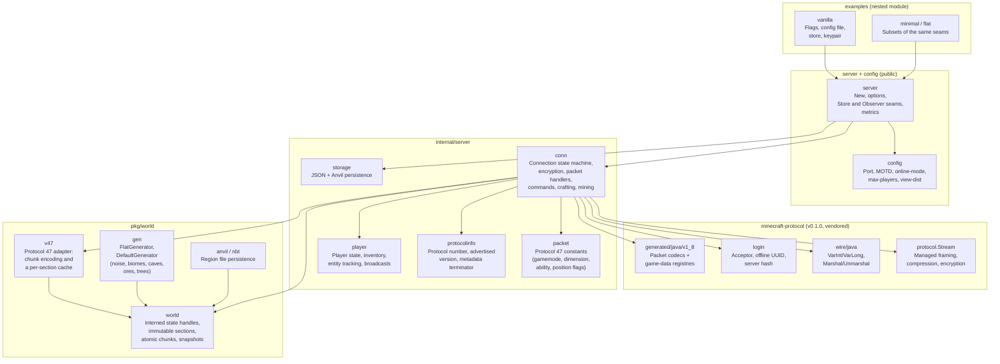
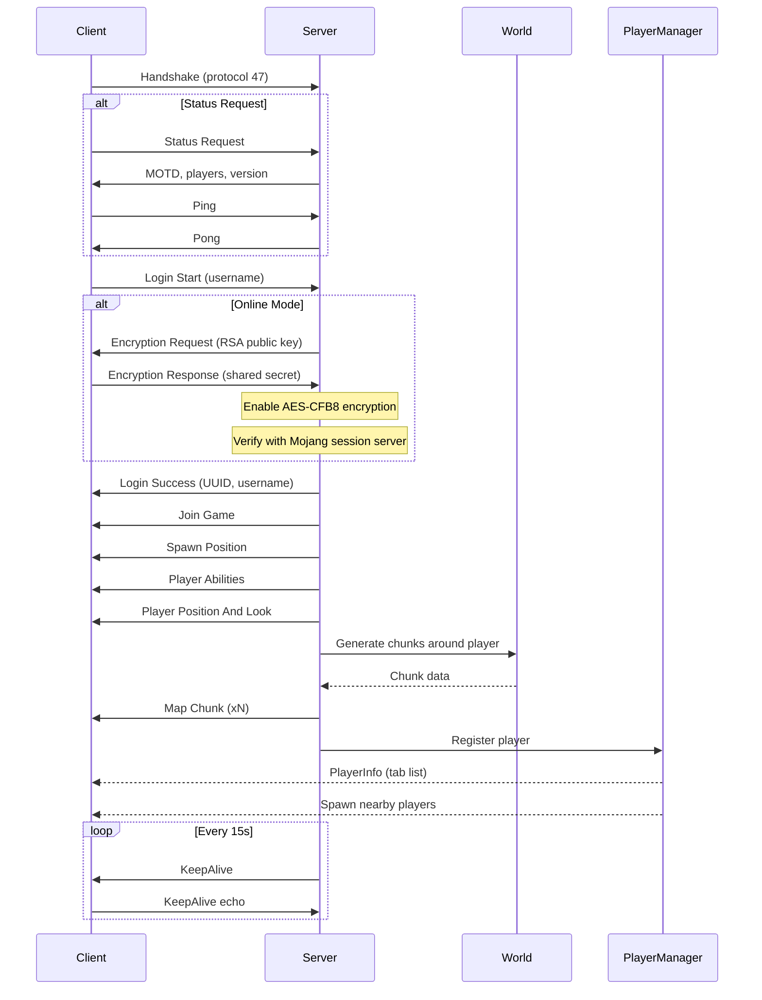
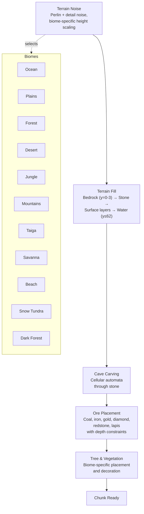
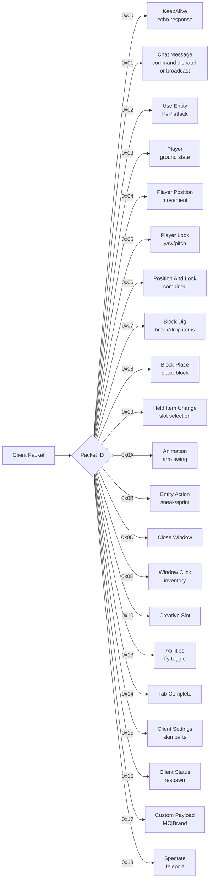

# minecraft-server

A Minecraft 1.8.9 (protocol 47) server framework in Go. It is a library first:
the pieces — settings, persistence, world generation, observation — are
composed by the application rather than wired together in a single binary, and
the programs under `examples/` are what compose them.

It is also the harness the protocol work runs against. A real client and the
pinned Node client both connect to a server built from this package, so a
change to [`minecraft-protocol`](https://github.com/go-theft-craft/minecraft-protocol)
is exercised here before it is believed.

```go
srv, err := server.New(
	server.WithLogger(log),
	server.WithMOTD("minimal example"),
	server.WithWorldRadius(4),
)
if err != nil {
	return err
}

return srv.Start(ctx)
```

### Examples

| Example | Demonstrates |
|---------|--------------|
| `examples/custom` | A world generator defined and registered by the application, from outside the framework's module |
| `examples/minimal` | The smallest server that still serves: logins into a generated world, no persistence, no configuration file |
| `examples/flat` | A generator supplied directly through `WithGenerator` rather than selected by name in settings |
| `examples/vanilla` | Everything at once: every flag, a configuration file, file-backed persistence, and a generated RSA keypair |

```bash
devbox run -- task build     # builds all three into build/
./build/vanilla -port 25566
```

### Seams

| Seam | What it replaces |
|------|------------------|
| `server.WorldStore` | Blocks and biomes. `server.FileStore` is the default; supply your own to keep a world anywhere else |
| `server.SideStore` | Per-chunk data the vanilla format has no field for |
| `server.PlayerStore` | Per-player state, as the public `server.PlayerData` |
| `server.Observer` | Measurement. Receives CPU, memory, and per-frame network samples; delivery never blocks the server |
| `gen.Generator` | World generation, through `server.WithGenerator` |

`Store` still names Anvil in `SaveWorldAnvil`, and player persistence still runs
on the concrete store. Both are M11.3's to fix, along with a version-neutral
`WorldStore`; the command set becomes a seam in M11.7.

## Features

- **Shared protocol** — framing, compression, encryption, and the login sequence come from [`minecraft-protocol`](https://github.com/go-theft-craft/minecraft-protocol)
- **Offline mode** — UUID v3 login, no encryption
- **Online mode** — RSA/AES-CFB8 encryption, Mojang session authentication
- **Compression** — negotiated during login, threshold configurable with `-compression-threshold` (default 256, `-1` disables)
- **Legacy server list** — answers the `FE 01` ping that 1.6 and older clients send
- **Graceful disconnect** — kicked players and a shutting-down server send a reason before the socket closes
- **Procedural world generation** — Perlin noise terrain with 11 biomes, caves, ores, and trees, every knob configurable
- **Flat world generator** — A list of layers, defaulting to the classic bedrock/stone/dirt/grass
- **Dynamic chunk loading** — View-distance-based loading/unloading with optional world boundary
- **Block interaction** — Dig and place blocks with broadcast and persistence
- **Multiplayer** — Player spawning, entity tracking, visibility streaming, movement sync
- **Chat & commands** — `/tp`, `/gamemode`, `/time`, `/help`, `/list`, `/say`, `/me`, `/kill`, `/seed`, `/save`
- **Inventory** — 36-slot hotbar, 4-slot armor, held item switching, item dropping
- **PvP combat** — Attack players with knockback and hurt animation
- **Item drops** — Thrown items with physics simulation and auto-pickup
- **Respawn** — Death screen and respawn flow via `/kill`
- **Persistence** — Auto-save world state, player edits, and player data (position, inventory, gamemode)
- **Configurable build height** — `max-build-height` flag (default 256)
- **Smart pre-generation** — Skips world pre-generation on restart if already saved
- **KeepAlive** — 30-second timeout enforcement
- **Server list** — MOTD, player count, version info
- **Generated wire types** — every packet, codec, and game-data registry comes from [`minecraft-protocol`](https://github.com/go-theft-craft/minecraft-protocol); the server owns no wire code and runs no code generation of its own
- **Interoperability lane** — `task test:interop` logs a pinned Node `minecraft-protocol` client into the server over loopback

## Prerequisites

- [Devbox](https://www.jetify.com/devbox) (provides Go 1.26.6, gofumpt, golangci-lint, go-task, etc.)

## Getting Started

```bash
git clone git@github.com:OCharnyshevich/minecraft-server.git
cd minecraft-server
direnv allow   # or: devbox shell
```

## Run

`task server` runs the vanilla example, which is the one that takes flags.

```bash
# Offline mode (default)
devbox run -- task server

# Online mode (Mojang authentication)
devbox run -- task server -- -online-mode

# Custom port and MOTD
devbox run -- task server -- -port 25566 -motd "My Server"

# Flat world with a seed
devbox run -- task server -- -generator flat -seed 42

# Limit world radius (in chunks)
devbox run -- task server -- -world-radius 32
```

Connect with a Minecraft 1.8.x client to `localhost:25565`.

### Vanilla Example Flags

| Flag | Default | Description |
|------|---------|-------------|
| `-port` | 25565 | Server listening port |
| `-online-mode` | false | Enable Mojang authentication + encryption |
| `-motd` | "A Minecraft Server" | Server description |
| `-max-players` | 20 | Max players shown in server list |
| `-view-distance` | 8 | Chunk view distance |
| `-seed` | 0 | World generation seed |
| `-generator` | "default" | Name of a registered generator: `default`, `flat`, or one the application added |
| `-world-radius` | 0 (infinite) | World boundary in chunks |
| `-auto-save` | 5 | Auto-save interval in minutes (0 = disabled) |
| `-max-build-height` | 256 | Maximum Y axis |

## Useful Commands

| Command | Description |
|---------|-------------|
| `devbox run -- task server` | Run the vanilla example |
| `devbox run -- task test` | Run all tests with coverage, then the examples lane |
| `devbox run -- task test:examples` | Build and start each example in the nested `examples` module |
| `devbox run -- task test:race` | Run all tests under the race detector |
| `devbox run -- task test:interop` | Loopback interop lane against the pinned Node client |
| `devbox run -- task fmt` | Format code (gci + gofumpt) |
| `devbox run -- task lint` | Run golangci-lint |
| `devbox run -- task build` | Build the three examples to `build/` |
| `devbox run -- task deps` | Download, tidy, and vendor dependencies |
| `devbox run -- task cleanup` | Remove build artifacts |

Run a single test:

```bash
devbox run -- go test -mod vendor -run TestName ./path/to/package/...
```

## Architecture

### High-Level Overview


```mermaid
graph TB
    subgraph CLI["examples (nested module)"]
        SERVER["vanilla<br/>Flags, config file,<br/>store, keypair"]
        MINIMAL["minimal / flat<br/>Subsets of the same seams"]
    end

    subgraph Protocol["minecraft-protocol (v0.1.0, vendored)"]
        STREAM["protocol.Stream<br/>Managed framing,<br/>compression, encryption"]
        WIRE["wire/java<br/>VarInt/VarLong,<br/>Marshal/Unmarshal"]
        LOGIN["login<br/>Acceptor, offline UUID,<br/>server hash"]
        GENV18["generated/java/v1_8<br/>Packet codecs +<br/>game-data registries"]
    end

    subgraph Framework["server + config (public)"]
        FRAMEWORK["server<br/>New, options,<br/>Store and Observer seams,<br/>metrics"]
        CONFIG["config<br/>Port, MOTD, online-mode,<br/>max-players, view-dist"]
    end

    subgraph Server["internal/server"]
        CONN["conn<br/>Connection state machine,<br/>encryption, packet handlers,<br/>commands, crafting, mining"]
        PACKET["packet<br/>Protocol 47 constants<br/>(gamemode, dimension,<br/>ability, position flags)"]
        PROTOINFO["protocolinfo<br/>Protocol number, advertised<br/>version, metadata terminator"]
        PLAYER["player<br/>Player state, inventory,<br/>entity tracking, broadcasts"]
        STORAGE["storage<br/>JSON + Anvil persistence"]
    end

    subgraph World["pkg/world"]
        WORLD["world<br/>Interned state handles,<br/>immutable sections,<br/>atomic chunks, snapshots"]
        V47["v47<br/>Protocol 47 adapter:<br/>chunk encoding and<br/>a per-section cache"]
        GEN["gen<br/>FlatGenerator,<br/>DefaultGenerator<br/>(noise, biomes, caves,<br/>ores, trees)"]
        ANVIL["anvil / nbt<br/>Region file persistence"]
    end

    SERVER --> FRAMEWORK
    MINIMAL --> FRAMEWORK
    FRAMEWORK --> CONFIG
    FRAMEWORK --> CONN
    FRAMEWORK --> STORAGE
    CONN --> STREAM
    CONN --> WIRE
    CONN --> LOGIN
    CONN --> GENV18
    CONN --> PACKET
    CONN --> PROTOINFO
    CONN --> PLAYER
    CONN --> WORLD
    CONN --> V47
    V47 --> WORLD
    GEN --> WORLD
    ANVIL --> WORLD
```

The arrow directions in `pkg/world` are the point of the model. `world` holds
block state as an opaque `State` handle minted by a `StateRegistry`; it knows
nothing about protocol 47, about generators, or about the Anvil format. The
three packages around it depend on `world` and not the other way round, so a
second protocol version is a second adapter rather than a change to the world.

### Connection Lifecycle


```mermaid
sequenceDiagram
    participant C as Client
    participant S as Server
    participant W as World
    participant PM as PlayerManager

    C->>S: Handshake (protocol 47)

    alt Status Request
        C->>S: Status Request
        S->>C: MOTD, players, version
        C->>S: Ping
        S->>C: Pong
    end

    C->>S: Login Start (username)

    alt Online Mode
        S->>C: Encryption Request (RSA public key)
        C->>S: Encryption Response (shared secret)
        Note over S: Enable AES-CFB8 encryption
        Note over S: Verify with Mojang session server
    end

    S->>C: Login Success (UUID, username)
    S->>C: Join Game
    S->>C: Spawn Position
    S->>C: Player Abilities
    S->>C: Player Position And Look

    S->>W: Generate chunks around player
    W-->>S: Chunk data
    S->>C: Map Chunk (xN)

    S->>PM: Register player
    PM-->>C: PlayerInfo (tab list)
    PM-->>C: Spawn nearby players

    loop Every 15s
        S->>C: KeepAlive
        C->>S: KeepAlive echo
    end
```

### World Generation Pipeline


```mermaid
graph TD
    A["Terrain Noise<br/>Perlin + detail noise,<br/>biome-specific height scaling"] --> B["Terrain Fill<br/>Bedrock (y=0-3) → Stone →<br/>Surface layers → Water (y≤62)"]
    B --> C["Cave Carving<br/>Cellular automata<br/>through stone"]
    C --> D["Ore Placement<br/>Coal, iron, gold, diamond,<br/>redstone, lapis<br/>with depth constraints"]
    D --> E["Tree & Vegetation<br/>Biome-specific placement<br/>and decoration"]
    E --> F["Chunk Ready"]

    subgraph Biomes
        B1["Ocean"]
        B2["Plains"]
        B3["Forest"]
        B4["Desert"]
        B5["Jungle"]
        B6["Mountains"]
        B7["Taiga"]
        B8["Savanna"]
        B9["Beach"]
        B10["Snow Tundra"]
        B11["Dark Forest"]
    end

    A -.->|selects| Biomes
```

### Play State Packet Handling


```mermaid
graph LR
    IN["Client Packet"] --> D{Packet ID}
    D -->|0x00| KA["KeepAlive<br/>echo response"]
    D -->|0x01| CHAT["Chat Message<br/>command dispatch<br/>or broadcast"]
    D -->|0x02| UE["Use Entity<br/>PvP attack"]
    D -->|0x03| PG["Player<br/>ground state"]
    D -->|0x04| PP["Player Position<br/>movement"]
    D -->|0x05| PL["Player Look<br/>yaw/pitch"]
    D -->|0x06| PPL["Position And Look<br/>combined"]
    D -->|0x07| BD["Block Dig<br/>break/drop items"]
    D -->|0x08| BP["Block Place<br/>place block"]
    D -->|0x09| HI["Held Item Change<br/>slot selection"]
    D -->|0x0A| ANIM["Animation<br/>arm swing"]
    D -->|0x0B| EA["Entity Action<br/>sneak/sprint"]
    D -->|0x0D| CW["Close Window"]
    D -->|0x0E| WC["Window Click<br/>inventory"]
    D -->|0x10| SCS["Creative Slot"]
    D -->|0x13| AB["Abilities<br/>fly toggle"]
    D -->|0x14| TC["Tab Complete"]
    D -->|0x15| CS["Client Settings<br/>skin parts"]
    D -->|0x16| RS["Client Status<br/>respawn"]
    D -->|0x17| CP["Custom Payload<br/>MC|Brand"]
    D -->|0x18| SP["Spectate<br/>teleport"]
```

## Project Structure

```
server/            The framework: New, options, the Store and Observer seams, metrics
config/            Server settings, defaults, and file/flag merge
examples/          Nested module: minimal, flat, and vanilla programs
internal/
  server/
    conn/          Connection state machine, encryption, packet handlers, commands, crafting, mining
    packet/        Protocol 47 constants (gamemode, dimension, ability, position flags)
    protocolinfo/  Protocol number, advertised version name, metadata terminator
    player/        Player state, inventory, entity tracking, broadcasts
    storage/       File persistence (JSON) for world and player data
pkg/
  world/           Version-neutral world model: state handles, immutable sections, atomic chunks
    v47/           Protocol 47 adapter: chunk encoding, state encoding, per-section encode cache
    gen/           World generators (default, flat, noise, biomes, caves, ores)
    anvil/         Anvil region file reader and writer
    nbt/           NBT encoding for persistence
interop/           Loopback interoperability lane (pinned Node minecraft-protocol client)
vendor/            Vendored Go dependencies (packets, codecs, and game data from minecraft-protocol)
```

All wire types, codecs, and game-data registries come from the vendored
`minecraft-protocol` module; the server owns no packet structs and runs no code
generation.

## Chat Commands

| Command | Description |
|---------|-------------|
| `/help` | List available commands |
| `/list` | Show online players |
| `/tp <player>` | Teleport to a player |
| `/tp <x> <y> <z>` | Teleport to coordinates |
| `/gamemode <mode>` | Switch game mode (survival, creative, adventure, spectator) |
| `/time set <value>` | Set world time (day, night, noon, midnight, or number) |
| `/say <message>` | Broadcast server announcement |
| `/me <action>` | Send action message |
| `/kill` | Kill yourself (triggers death screen + respawn) |
| `/seed` | Show world seed |
| `/save` | Save world and player data |

## World Generation

A generator is selected by name and configured with typed parameters. Two ship
with the framework, and an application can register its own.

```jsonc
// data/config.json
{
  "generator_type": "flat",
  "generator_params": {
    "layers": [
      { "block": "minecraft:bedrock", "thickness": 1 },
      { "block": "minecraft:sandstone", "thickness": 30 },
      { "block": "minecraft:sand", "thickness": 4 }
    ],
    "biome": "minecraft:desert"
  }
}
```

`generator_params` is optional; omit it for the defaults. A key the generator
does not have is an error rather than a line nobody reads, and so is a name no
generator is registered under — before this, a misspelled `-generator` silently
gave you the default terrain.

**`flat`** takes a list of layers from the bottom up, and one biome:

| Parameter | Default |
| --- | --- |
| `layers` | bedrock ×1, stone ×2, dirt ×1, grass ×1 |
| `biome` | `minecraft:plains` |

**`default`** is the noise generator. Its parameters are grouped:

| Group | What it holds |
| --- | --- |
| top level | `sea_level` (62), `terrain_scale` (128), `detail_scale` (32), `detail_amplitude` (4), `min_height` (1), `max_height` (250), `bedrock_depth` (3) |
| `surface` | the seven blocks the surface pass places, its `depth` (4) and `desert_depth` (5), and `bare_stone_above` (100) — the height a mountain loses its grass |
| `caves` | `threshold` (0.55), `lava_level` (10), `min_y` (4), `surface_margin` (4), and the four noise scales |
| `ores` | a list of `{block, min_y, max_y, vein_size, attempts}`; six entries by default |
| `trees` | `density` per biome name, `default_density` (2), `vegetation_attempts` (20) |
| `biomes` | `temperature_scale` and `rainfall_scale` (512), `ocean_below` (8), `beach_below` (2), and per-biome `{amplitude, base_offset}` |

Every block is a canonical name — `minecraft:diamond_ore` — resolved once when
the generator is built, so a name nothing knows is an error at startup rather
than a wrong block a thousand chunks away. Biome heights are offsets from sea
level, so moving `sea_level` moves the land with it.

To see the whole surface, marshal the defaults:

```go
raw, _ := gen.MarshalParams(gen.DefaultDefaults())
fmt.Println(string(raw))
```

### Registering your own

`examples/custom` is a complete one in about a hundred lines: a checkerboard
with a configurable square size, registered under `"checker"`. The shape is a
`gen.Factory` — a name, a version, defaults, a parser, and a constructor —
added to a registry the server is built with:

```go
registry := gen.DefaultRegistry()
registry.Register(CheckerFactory{})

srv, err := server.New(
    server.WithGeneratorRegistry(registry),
    server.WithGeneratorNamed("checker", CheckerParams{Period: 8}),
)
```

`examples/` is a separate module with a `replace` for the parent, so what that
example can reach is exactly what any consumer can reach.

### What it is not

This generator does not reproduce vanilla terrain and does not try. It shares
vanilla's *shape* — noise heightmap, biomes, caves, ores, decoration — and none
of its algorithms, so the same seed gives a different world here than it does
in Minecraft. A world made here is a world made here.

The world records which generator, which version, and which parameters made it.
When the configuration disagrees, the world's record wins on the generator's
name and its parameters, because a superflat plane that starts growing
mountains at the edge of what has been explored is nobody's intent. A version
mismatch warns and keeps generating with the running version, because
regenerating the old chunks would rewrite terrain someone has built on.

## Persistence

The world lives in Anvil region files — the format vanilla uses — and the
server reads them back. It auto-saves every 5 minutes (configurable via
`-auto-save`) and on shutdown, and a save writes only the chunks that changed
since the last one.

```
data/
├── config.json                   # Server config
├── world/
│   └── overworld/
│       ├── level.json            # World time, seed, generator
│       ├── region/
│       │   └── r.X.Z.mca         # Blocks, biomes, and chest contents
│       └── sidecar/
│           └── s.X.Z.json        # What the vanilla format has no field for
└── players/
    ├── <uuid>.json               # Position, gamemode, inventory per player
    └── ...
```

A data directory written by an older build holds `world/world.json`,
`world/overrides.json`, and `world/chests.json`. Those are folded into the
region files once, on the first start, and then renamed to `*.migrated` — a
rename rather than a delete, so there is something to go back to.

Persistence is three separate seams, so an application can replace one and keep
the defaults for the other two:

| Seam | Holds |
| --- | --- |
| `server.WorldStore` | Blocks, biomes, and the tile entities vanilla has fields for |
| `server.SideStore` | Everything vanilla has no field for |
| `server.PlayerStore` | Per-player state, as the public `server.PlayerData` |

`server.FileStore(dir, log)` returns all three, and `store.Options()` installs
them.

## Provenance

Off by default. Turned on, the server records what happened to blocks and
items, and gives every item an identity that survives a restart.

```
devbox run -- task server -- -provenance -provenance-days 7 -provenance-gb 4
```

| What it holds | Where |
| --- | --- |
| Block placements and breaks, item movements, crafting, drops, pickups | `data/provenance/provenance-*.ndjson` |
| A manifest of each file's time range and a bloom filter over its item IDs | `data/provenance/manifest.json` |

Three questions can be asked of it through `server.ProvenanceStore`:

| Query | Answers | Cost |
| --- | --- | --- |
| `AtPosition` | everything that happened at one block | a linear scan of the files overlapping the window |
| `ByActor` | everything one player did | the same scan |
| `ForItem` | one item's whole history, oldest first | the same scan, skipping the files a bloom filter excludes |

None of the three is fast enough to build something interactive on. That is a
property of the default file store, not of the interface, and a different store
is one option away.

### What it costs

A record is 200–300 bytes. A busy server writes gigabytes a week, which is why
retention is both a window and a cap — whichever is reached first, whole files
are deleted oldest first.

Recording runs off the tick through a bounded queue. When the queue fills the
record is dropped and counted rather than blocking the world, because a stalled
world is a worse failure than a gap in an audit trail;
`server.ProvenanceOverflowBlocks()` makes the other trade. Turned off, the cost
is one nil check — about 6 ns and no allocations, which a test pins rather than
a benchmark nobody reads.

**The logs hold player names and UUIDs.** They are local runtime data under the
data directory, nothing sends them anywhere, and they are covered by whatever
retention you set — not by anything this server decides for you.

### Item identity

Every item can carry an ID that is unique for the life of a server: 24 bits of
run epoch, persisted with the world and advanced once per start, and 40 bits of
counter. The epoch is stored rather than taken from the clock, because a clock
that moves backwards would mint colliding IDs.

The index those IDs live in is the *write path*, not an observer of it. A move
that claims an item came from somewhere it is not is a duplication caught as it
happens, named with both locations and the actor. The default policy records it
and lets the write through: refusing turns a duplication bug into item loss,
and item loss on a false positive is worse for the player than an extra item.

**Not finished.** The identity machinery is built and tested, and the detector
is proved against the shape of a real past bug, but the inventory click paths
do not route through the index yet. Until they do, item identity is incomplete
and the whole feature stays off; see the M11.5 record in the master plan.

## Protocol Coverage

Minecraft 1.8.8 (protocol 47) implementation status:

| Category | Implemented | Total | Coverage |
|---|---|---|---|
| Handshake | 1 | 1 | 100% |
| Status | 4 | 4 | 100% |
| Login | 4 | 4 | 100% |
| Play (server-bound) | 18 | 26 | 69% |
| Play (client-bound) | 25 | 74 | 34% |
| **Total** | **52** | **109** | **48%** |

### What works

- Full connection lifecycle: handshake, status ping, login (offline + online mode)
- Player movement, look, sneaking, sprinting with sprint particles
- Block dig and place with broadcast to other players
- PvP combat: attack with knockback, hurt animation, death animation
- Chat messaging and commands (including `/save`, `/kill` with respawn)
- Multiplayer: player spawning, entity tracking, visibility streaming, periodic position resyncs
- Inventory: hotbar, armor, held item, crafting (2x2 inventory grid and the 3x3 crafting table), item dropping with physics
- Item entities: throw arc simulation, terrain-aware landing, auto-pickup
- Procedural world generation with biomes, caves, ores, trees
- Dynamic chunk loading/unloading with smart pre-generation skip on restart
- World and player data persistence (time, block overrides, player state)
- Gamemode switching with tab list broadcast
- Flying toggle (creative/spectator)
- MC|Brand plugin channel exchange
- Spectator teleport
- KeepAlive with 30s timeout

### What's missing

**World Features** — No weather, sounds. Missing: `spawn_entity_weather`, `world_border`, `explosion`, `named_sound_effect`.

**Mobs & NPCs** — No mob spawning or AI. Missing: `spawn_entity_living`, `spawn_entity_painting`, `spawn_entity_experience_orb`, `attach_entity`.

**Scoreboard & Teams** — Missing: `scoreboard_objective`, `scoreboard_score`, `scoreboard_display_objective`, `scoreboard_team`.

**UI & Misc** — Missing: `title`, `playerlist_header`, `statistics`, `map`, `camera`, `resource_pack_send`.

## Roadmap

1. **Health & hunger** — Survival damage, food system, natural regeneration
2. **Mob spawning** — Living entities, AI, health, combat
3. **Tile entities** — Signs, chests, banners
4. **Weather** — Rain, thunder, lightning
5. **Scoreboard & Teams** — Sidebar scores, team colors

## How to Commit

1. Format and lint before committing:
   ```bash
   devbox run -- task fmt
   devbox run -- task lint
   ```

2. Run tests:
   ```bash
   devbox run -- task test
   ```

3. Stage and commit:
   ```bash
   git add <files>
   git commit -m "Short description of the change"
   ```

All commands must be run through `devbox run --` to use the Nix-managed toolchain. Never run `go build`, `gofumpt`, or `golangci-lint` directly.

## License

[Apache License 2.0](LICENSE)
