# Server protocol migration implementation plan

> **For agentic workers:** REQUIRED SUB-SKILL: Use superpowers:subagent-driven-development (recommended) or superpowers:executing-plans to implement this plan task-by-task. Steps use checkbox (`- [ ]`) syntax for tracking.

**Goal:** Move the `server` repository's entire connection path onto
`minecraft-protocol`'s managed stream and generated protocol 47 packets, and
delete the duplicate framing, cipher, and packet codegen it replaces.

**Architecture:** `Connection` keeps its lifecycle role and gives up its socket.
A `protocol.Stream` owns the transport, framing, compression, and the cipher; a
`login.ServerNegotiator` added upstream drives the login exchange; the existing
handlers move from the server's `pkt` types to `minecraft-protocol`'s generated
`v1_8` types. A temporary raw bridge carries not-yet-migrated packets through
the stream as opaque payloads so the tree compiles and tests after every task,
and it is deleted in Task 16.

**Tech Stack:** Go 1.26.5, Devbox, Task, `minecraft-protocol` (no external
dependencies), pinned Node `minecraft-protocol` 1.66.2 for interoperability.

**Spec:** [Server protocol migration design](../specs/2026-08-15-server-protocol-migration-design.md)

**Reference:** [Packet name map](2026-08-15-packet-name-map.md) — all 111
matched types, their state, direction, ID, and whether each is a rename or a
rewrite.

## Global Constraints

- M2 must be implemented and pushed before Task 6. Tasks 1 to 5 build on M2's
  `wire/java` and `login` packages and cannot start earlier either.
- Tasks 1 to 5 work in `/home/ocharnyshevich/pet.projects/go-theft-craft/minecraft-protocol`.
  Tasks 6 to 18 work in `/home/ocharnyshevich/pet.projects/go-theft-craft/server`.
- Run every command as `devbox run -- task <name>`. Never call `go`,
  `gofumpt`, `gci`, or `golangci-lint` directly.
- `minecraft-protocol` has **no external dependencies**. `go.mod` has no
  `require` block and must still have none when Task 5 finishes.
- `server` vendors its dependencies and builds with `-mod vendor`. Run
  `devbox run -- task deps` after any `go.mod` change.
- Protocol 47 only. Do not add protocol 775 packets or a configuration state.
- Never print, log, wrap, or return a plaintext shared secret. `SharedSecret`
  redacts itself.
- Never commit an RSA private key or a fixture containing one. Generate keys
  inside tests with `rsa.GenerateKey`.
- Pass `context.Context` as the first argument to every blocking public
  operation. Do not store a caller context in a struct.
- Split validation from application: every check that can fail belongs in a
  `Validate` path so the matching `Apply` cannot fail after bytes have left the
  process.
- Each task ends with a commit. Run `devbox run -- task precommit` in
  `minecraft-protocol` and `devbox run -- task lint test` in `server` before
  committing.
- Never add the `Co-Authored-By` or `Claude-Session` trailer to a commit
  message.
- Do not delete a single line of the old framing, cipher, or packet codegen
  before Task 16. Tasks 7 and 8 capture golden bytes from that code, and it
  must still exist to produce them.

## File Structure

### `minecraft-protocol` (Tasks 1 to 5)

| File | Responsibility |
| --- | --- |
| `internal/codegen/generator/templates/protocol.go.tmpl` | Emit the `Envelope` helper |
| `generated/java/v1_8/protocol.go` | Regenerated output |
| `generated/java/v1_8/envelope_test.go` | Envelope success and rejection cases |
| `login/server.go` | `ServerKey`, `ServerOption`, `ServerNegotiator` |
| `login/server_test.go` | Offline, online, and every failure mode |
| `interop/node/runner.mjs` | Client-mode scenarios against a Go server |
| `interop/node_test.go` | Two server-role interoperability tests |

### `server` (Tasks 6 to 18)

| File | Responsibility |
| --- | --- |
| `internal/server/conn/stream.go` | Stream construction, limits, envelope helper, raw bridge |
| `internal/server/conn/legacy_ping.go` | The legacy `FE 01` status handler |
| `internal/server/conn/login.go` | Verifier implementation and negotiator wiring; replaces `handler_login.go` |
| `internal/server/conn/testdata/parity/` | Golden bytes captured before migration |
| `internal/server/conn/parity_test.go` | Old and new encoders must agree byte for byte |
| `interop/node/runner.mjs`, `interop/node_test.go` | Node client lane against the Go server |
| `internal/server/config/config.go` | `CompressionThreshold` |
| Deleted in Task 16 | `pkg/protocol/`, `conn/cfb8.go`, `conn/cfb8_test.go`, `conn/encrypted_conn.go`, `conn/slot.go`, packet generation in `cmd/codegen` |

---

## Part 1 — Upstream additions in `minecraft-protocol`

### Task 1: The packet envelope helper

`protocol.Packet` is an envelope whose `State`, `Direction`, and `ID` must
match the value's own registration, and `EncodeFrame` rejects a mismatch. Every
server write would otherwise repeat three fields or read `Stream.Snapshot`,
which is a coordinator round trip on the play hot path. The generated package
already holds `packetKeyForValue`, so it can answer this itself.

**Files:**
- Modify: `internal/codegen/generator/templates/protocol.go.tmpl`
- Modify: `generated/java/v1_8/protocol.go` (regenerated, do not hand-edit)
- Test: `generated/java/v1_8/envelope_test.go`

**Interfaces:**
- Consumes: `packetKeyForValue(packetCodec) (packetKey, bool)` and
  `packetNames map[packetKey]string`, both already in the generated file.
- Produces: `func Envelope(value any) (protocol.Packet, error)` and
  `var ErrUnregisteredPacket = errors.New("unregistered packet value")` in
  every generated protocol package.

- [ ] **Step 1: Write the failing test**

Create `generated/java/v1_8/envelope_test.go`:

```go
package v1_8_test

import (
	"errors"
	"testing"

	protocol "github.com/go-theft-craft/minecraft-protocol"
	v1_8 "github.com/go-theft-craft/minecraft-protocol/generated/java/v1_8"
)

func TestEnvelopeDerivesStateDirectionAndID(t *testing.T) {
	t.Parallel()

	packet, err := v1_8.Envelope(&v1_8.LoginClientboundSuccess{
		UUID:     "00000000-0000-3000-8000-000000000000",
		Username: "interop",
	})
	if err != nil {
		t.Fatalf("Envelope() error = %v", err)
	}

	if packet.State != v1_8.StateLogin {
		t.Errorf("State = %q, want %q", packet.State, v1_8.StateLogin)
	}
	if packet.Direction != protocol.DirectionClientbound {
		t.Errorf("Direction = %d, want %d", packet.Direction, protocol.DirectionClientbound)
	}
	if packet.ID != 0x02 {
		t.Errorf("ID = %#x, want %#x", packet.ID, 0x02)
	}
	if packet.Name != "login/clientbound/success" {
		t.Errorf("Name = %q, want a registered name", packet.Name)
	}
	if packet.Value == nil {
		t.Error("Value = nil, want the supplied value")
	}
}

func TestEnvelopeRejectsAnUnregisteredValue(t *testing.T) {
	t.Parallel()

	if _, err := v1_8.Envelope(struct{ Field int }{}); !errors.Is(err, v1_8.ErrUnregisteredPacket) {
		t.Fatalf("Envelope() error = %v, want ErrUnregisteredPacket", err)
	}
}

func TestEnvelopeRejectsNil(t *testing.T) {
	t.Parallel()

	if _, err := v1_8.Envelope(nil); !errors.Is(err, v1_8.ErrUnregisteredPacket) {
		t.Fatalf("Envelope() error = %v, want ErrUnregisteredPacket", err)
	}
}
```

The expected `Name` must match what `packetNames` holds for that key. Read the
generated `packetNames` map and use the exact string; if it is not
`"login/clientbound/success"`, correct the test to the real value before
running it.

- [ ] **Step 2: Run the test to verify it fails**

Run: `devbox run -- go test ./generated/java/v1_8/ -run TestEnvelope -v`
Expected: FAIL, `undefined: v1_8.Envelope`.

- [ ] **Step 3: Add the helper to the template**

Append to `internal/codegen/generator/templates/protocol.go.tmpl`, after the
session methods:

```go
// ErrUnregisteredPacket reports a value that this protocol does not generate.
var ErrUnregisteredPacket = errors.New("unregistered packet value")

// Envelope returns the packet envelope for a generated value, taking state,
// direction, and ID from the value's own registration. It never reads session
// state, so a caller can build an envelope without a coordinator round trip.
func Envelope(value any) (protocol.Packet, error) {
	codec, ok := value.(packetCodec)
	if !ok {
		return protocol.Packet{}, fmt.Errorf("%w: %T", ErrUnregisteredPacket, value)
	}

	key, registered := packetKeyForValue(codec)
	if !registered {
		return protocol.Packet{}, fmt.Errorf("%w: %T", ErrUnregisteredPacket, value)
	}

	return protocol.Packet{
		State:     key.State,
		Direction: key.Direction,
		ID:        key.ID,
		Name:      packetNames[key],
		Value:     value,
	}, nil
}
```

Add `"errors"` to the template's import list if it is not already there.

- [ ] **Step 4: Regenerate and verify**

Run: `devbox run -- task generate`
Then: `devbox run -- go test ./generated/java/v1_8/ -run TestEnvelope -v`
Expected: PASS.

- [ ] **Step 5: Verify the generator is reproducible**

Run: `devbox run -- task generate:check`
Expected: PASS with no diff. A failure here means the template writes
non-deterministic output.

- [ ] **Step 6: Run the full gate and commit**

```bash
devbox run -- task precommit
git add internal/codegen/generator/templates/protocol.go.tmpl \
        generated/java/v1_8/protocol.go \
        generated/java/v1_8/envelope_test.go
git commit -m "feat(protocol): derive packet envelopes from the registry"
```

---

### Task 2: The server negotiator, offline path

M2 declares `login.Verifier` and implements only the client `Negotiator`. Its
tests drive the server half by hand. This task promotes that sequence into a
supported type, starting with the path that needs no cryptography.

**Files:**
- Create: `login/server.go`
- Test: `login/server_test.go`

**Interfaces:**
- Consumes: `login.Profile`, `login.ErrInvalidLoginField` (Task 7 of the M2
  plan); `java.ParseUsername`, `java.ParseUUID` (Task 4 of the M2 plan);
  `v1_8.Envelope` (Task 1); `protocol.Stream.Read`, `protocol.Stream.Write`.
- Produces: `type ServerOption func(*ServerNegotiator) error`;
  `func NewServerNegotiator(options ...ServerOption) (*ServerNegotiator, error)`;
  `func (*ServerNegotiator) Negotiate(context.Context, *protocol.Stream) (Profile, error)`;
  `func (*ServerNegotiator) NegotiateFrom(context.Context, *protocol.Stream, *v1_8.LoginServerboundLoginStart) (Profile, error)`;
  `func OfflineUUID(java.Username) java.UUID`.

Two entry points exist because a server that already runs its own read loop has
consumed `LoginStart` before it knows a login is starting. `Negotiate` reads
that packet and delegates; `NegotiateFrom` takes it as an argument. Task 11
calls the second. Both own inbound delivery for the rest of the sequence.

- [ ] **Step 1: Write the failing test**

Create `login/server_test.go`. `newLoginPair` builds two streams over an
`net.Pipe`, one per role; copy the helper the M2 client negotiator tests
already use in `login/negotiator_test.go` rather than writing a new one.

```go
func TestServerNegotiateCompletesAnOfflineLogin(t *testing.T) {
	t.Parallel()

	client, server := newLoginPair(t)

	negotiator, err := login.NewServerNegotiator()
	if err != nil {
		t.Fatalf("NewServerNegotiator() error = %v", err)
	}

	profiles := make(chan login.Profile, 1)
	errs := make(chan error, 1)
	go func() {
		profile, err := negotiator.Negotiate(t.Context(), server)
		profiles <- profile
		errs <- err
	}()

	writePacket(t, client, &v1_8.LoginServerboundLoginStart{Username: "interop"})

	packet := readPacket(t, client)
	success, ok := packet.Value.(*v1_8.LoginClientboundSuccess)
	if !ok {
		t.Fatalf("packet.Value = %T, want *LoginClientboundSuccess", packet.Value)
	}
	if success.Username != "interop" {
		t.Errorf("Username = %q, want %q", success.Username, "interop")
	}
	// Version 3 UUID derived from "OfflinePlayer:interop".
	if success.UUID != "8667ba71-b85a-3004-af54-457a9734eed7" {
		t.Errorf("UUID = %q, want the offline UUID", success.UUID)
	}

	if err := <-errs; err != nil {
		t.Fatalf("Negotiate() error = %v", err)
	}
	if profile := <-profiles; profile.Name.String() != "interop" {
		t.Errorf("Profile.Name = %q, want %q", profile.Name, "interop")
	}
}

func TestServerNegotiateRejectsAnInvalidUsername(t *testing.T) {
	t.Parallel()

	client, server := newLoginPair(t)

	negotiator, err := login.NewServerNegotiator()
	if err != nil {
		t.Fatalf("NewServerNegotiator() error = %v", err)
	}

	errs := make(chan error, 1)
	go func() {
		_, err := negotiator.Negotiate(t.Context(), server)
		errs <- err
	}()

	writePacket(t, client, &v1_8.LoginServerboundLoginStart{Username: "not a valid name!"})

	if err := <-errs; !errors.Is(err, login.ErrInvalidLoginField) {
		t.Fatalf("Negotiate() error = %v, want ErrInvalidLoginField", err)
	}
}

func TestServerNegotiateRejectsAnUnexpectedPacket(t *testing.T) {
	t.Parallel()

	client, server := newLoginPair(t)

	negotiator, err := login.NewServerNegotiator()
	if err != nil {
		t.Fatalf("NewServerNegotiator() error = %v", err)
	}

	errs := make(chan error, 1)
	go func() {
		_, err := negotiator.Negotiate(t.Context(), server)
		errs <- err
	}()

	writePacket(t, client, &v1_8.LoginServerboundEncryptionBegin{
		SharedSecret: []byte{0x01},
		VerifyToken:  []byte{0x02},
	})

	if err := <-errs; !errors.Is(err, login.ErrUnexpectedLoginPacket) {
		t.Fatalf("Negotiate() error = %v, want ErrUnexpectedLoginPacket", err)
	}
}
```

The offline UUID in the first test is the version 3 MD5 UUID of
`OfflinePlayer:interop`. Compute it once with the implementation from Step 3
and paste the literal; do not leave it as a call, because that would test the
implementation against itself.

- [ ] **Step 2: Run the tests to verify they fail**

Run: `devbox run -- go test ./login/ -run TestServerNegotiate -v`
Expected: FAIL, `undefined: login.NewServerNegotiator`.

- [ ] **Step 3: Write the offline implementation**

Create `login/server.go`:

```go
// Package login drives the Java Edition login sequence from either endpoint.
package login

import (
	"context"
	"crypto/md5"
	"errors"
	"fmt"

	protocol "github.com/go-theft-craft/minecraft-protocol"
	v1_8 "github.com/go-theft-craft/minecraft-protocol/generated/java/v1_8"
	"github.com/go-theft-craft/minecraft-protocol/wire/java"
)

// ErrUnexpectedLoginPacket reports a login packet arriving out of sequence.
var ErrUnexpectedLoginPacket = errors.New("unexpected login packet")

// ServerNegotiator runs the server half of the protocol 47 login sequence.
//
// It calls Stream.Read, so it owns inbound delivery for the duration of the
// login exactly as the client Negotiator does. A caller that reads
// concurrently would steal packets the negotiator needs. The caller resumes
// reading after Negotiate returns.
type ServerNegotiator struct{}

// ServerOption configures a negotiator before it runs.
type ServerOption func(*ServerNegotiator) error

// NewServerNegotiator returns a negotiator. With no options it completes an
// offline login: no encryption, no verification, and no compression.
func NewServerNegotiator(options ...ServerOption) (*ServerNegotiator, error) {
	negotiator := &ServerNegotiator{}
	for _, option := range options {
		if option == nil {
			return nil, fmt.Errorf("%w: nil option", ErrInvalidLoginField)
		}
		if err := option(negotiator); err != nil {
			return nil, err
		}
	}

	return negotiator, nil
}

// Negotiate reads the login start packet and runs the login sequence. It
// blocks until login finishes or fails.
func (n *ServerNegotiator) Negotiate(ctx context.Context, stream *protocol.Stream) (Profile, error) {
	packet, err := stream.Read(ctx)
	if err != nil {
		return Profile{}, fmt.Errorf("read login start: %w", err)
	}

	start, ok := packet.Value.(*v1_8.LoginServerboundLoginStart)
	if !ok {
		return Profile{}, fmt.Errorf("%w: %s", ErrUnexpectedLoginPacket, packet.Name)
	}

	return n.NegotiateFrom(ctx, stream, start)
}

// NegotiateFrom runs the login sequence for a login start packet the caller
// has already read. A server with its own read loop uses this entry point.
func (n *ServerNegotiator) NegotiateFrom(
	ctx context.Context,
	stream *protocol.Stream,
	start *v1_8.LoginServerboundLoginStart,
) (Profile, error) {
	if start == nil {
		return Profile{}, fmt.Errorf("%w: nil login start", ErrInvalidLoginField)
	}

	username, err := java.ParseUsername(start.Username)
	if err != nil {
		return Profile{}, err
	}

	profile := Profile{Name: username, UUID: OfflineUUID(username)}

	return profile, n.sendSuccess(ctx, stream, profile)
}

func (n *ServerNegotiator) sendSuccess(
	ctx context.Context,
	stream *protocol.Stream,
	profile Profile,
) error {
	success, err := v1_8.Envelope(&v1_8.LoginClientboundSuccess{
		UUID:     profile.UUID.String(),
		Username: profile.Name.String(),
	})
	if err != nil {
		return err
	}

	// The session proposes the login-to-play transition from this packet and
	// the stream commits it, so the negotiator sets no state itself.
	return stream.Write(ctx, success)
}

// OfflineUUID derives the version 3 UUID Java Edition assigns to an
// unauthenticated account.
func OfflineUUID(username java.Username) java.UUID {
	sum := md5.Sum([]byte("OfflinePlayer:" + username.String()))
	sum[6] = (sum[6] & 0x0f) | 0x30
	sum[8] = (sum[8] & 0x3f) | 0x80

	return java.UUID(sum)
}
```

`md5` is used because Java Edition specifies it for offline identity. It is not
a security decision. If `golangci-lint` flags the import, add a
`//nolint:gosec` comment naming that reason.

- [ ] **Step 4: Run the tests to verify they pass**

Run: `devbox run -- go test ./login/ -run TestServerNegotiate -v`
Expected: PASS.

- [ ] **Step 5: Commit**

```bash
devbox run -- task precommit
git add login/server.go login/server_test.go
git commit -m "feat(login): add the offline server negotiator"
```

---

### Task 3: The server negotiator, online path

**Files:**
- Modify: `login/server.go`
- Modify: `login/server_test.go`

**Interfaces:**
- Consumes: `login.Verifier` (M2); `java.SharedSecret`,
  `java.DecryptFromServerKey`, `java.VerifyToken`, `java.ComputeServerHash`,
  `java.EncodeServerPublicKey`, `java.EncryptionControl` (M2);
  `protocol.Stream.Control`.
- Produces: `func WithServerKey(*rsa.PrivateKey) ServerOption`;
  `func WithVerifier(Verifier) ServerOption`; `login.ErrVerificationFailed`.

- [ ] **Step 1: Write the failing tests**

Add to `login/server_test.go`:

```go
type stubVerifier struct {
	profile login.Profile
	err     error
	hash    java.ServerHash
}

func (v *stubVerifier) Verify(
	_ context.Context,
	_ java.Username,
	hash java.ServerHash,
) (login.Profile, error) {
	v.hash = hash
	return v.profile, v.err
}

func TestServerNegotiateCompletesAnOnlineLogin(t *testing.T) {
	t.Parallel()

	key, err := rsa.GenerateKey(rand.Reader, 1024)
	if err != nil {
		t.Fatalf("GenerateKey() error = %v", err)
	}

	verifier := &stubVerifier{profile: newProfile(t, "interop", "069a79f4-44e9-4726-a5be-fca90e38aaf5")}

	client, server := newLoginPair(t)
	negotiator, err := login.NewServerNegotiator(
		login.WithServerKey(key),
		login.WithVerifier(verifier),
	)
	if err != nil {
		t.Fatalf("NewServerNegotiator() error = %v", err)
	}

	errs := make(chan error, 1)
	go func() {
		_, err := negotiator.Negotiate(t.Context(), server)
		errs <- err
	}()

	writePacket(t, client, &v1_8.LoginServerboundLoginStart{Username: "interop"})

	begin, ok := readPacket(t, client).Value.(*v1_8.LoginClientboundEncryptionBegin)
	if !ok {
		t.Fatal("want *LoginClientboundEncryptionBegin")
	}
	if begin.ServerID != "" {
		t.Errorf("ServerID = %q, want empty for protocol 47", begin.ServerID)
	}

	// The client half: encrypt a fresh secret and the returned token.
	public, err := java.ParseServerPublicKey(begin.PublicKey)
	if err != nil {
		t.Fatalf("ParseServerPublicKey() error = %v", err)
	}
	secret, err := java.NewSharedSecret()
	if err != nil {
		t.Fatalf("NewSharedSecret() error = %v", err)
	}
	encryptedSecret, err := java.EncryptToServerKey(public, secret.Reveal())
	if err != nil {
		t.Fatalf("EncryptToServerKey() error = %v", err)
	}
	encryptedToken, err := java.EncryptToServerKey(public, begin.VerifyToken)
	if err != nil {
		t.Fatalf("EncryptToServerKey() error = %v", err)
	}

	writePacket(t, client, &v1_8.LoginServerboundEncryptionBegin{
		SharedSecret: encryptedSecret,
		VerifyToken:  encryptedToken,
	})
	enableClientEncryption(t, client, secret)

	success, ok := readPacket(t, client).Value.(*v1_8.LoginClientboundSuccess)
	if !ok {
		t.Fatal("want *LoginClientboundSuccess")
	}
	if success.Username != "interop" {
		t.Errorf("Username = %q, want %q", success.Username, "interop")
	}
	if err := <-errs; err != nil {
		t.Fatalf("Negotiate() error = %v", err)
	}

	want, err := java.ComputeServerHash("", secret, &key.PublicKey)
	if err != nil {
		t.Fatalf("ComputeServerHash() error = %v", err)
	}
	if verifier.hash != want {
		t.Errorf("verifier saw hash %v, want %v", verifier.hash, want)
	}
}

func TestServerNegotiateRejectsAMismatchedVerifyToken(t *testing.T) {
	t.Parallel()

	key, verifier, client, server := newOnlinePair(t)
	negotiator, err := login.NewServerNegotiator(
		login.WithServerKey(key),
		login.WithVerifier(verifier),
	)
	if err != nil {
		t.Fatalf("NewServerNegotiator() error = %v", err)
	}

	errs := make(chan error, 1)
	go func() {
		_, err := negotiator.Negotiate(t.Context(), server)
		errs <- err
	}()

	writePacket(t, client, &v1_8.LoginServerboundLoginStart{Username: "interop"})
	begin := readEncryptionBegin(t, client)

	public, err := java.ParseServerPublicKey(begin.PublicKey)
	if err != nil {
		t.Fatalf("ParseServerPublicKey() error = %v", err)
	}
	secret, err := java.NewSharedSecret()
	if err != nil {
		t.Fatalf("NewSharedSecret() error = %v", err)
	}
	encryptedSecret, err := java.EncryptToServerKey(public, secret.Reveal())
	if err != nil {
		t.Fatalf("EncryptToServerKey() error = %v", err)
	}
	// A token the server never issued.
	wrongToken, err := java.EncryptToServerKey(public, []byte{0, 0, 0, 0})
	if err != nil {
		t.Fatalf("EncryptToServerKey() error = %v", err)
	}

	writePacket(t, client, &v1_8.LoginServerboundEncryptionBegin{
		SharedSecret: encryptedSecret,
		VerifyToken:  wrongToken,
	})

	if err := <-errs; !errors.Is(err, java.ErrVerifyTokenMismatch) {
		t.Fatalf("Negotiate() error = %v, want ErrVerifyTokenMismatch", err)
	}
	if verifier.hash != (java.ServerHash{}) {
		t.Error("verifier was called despite a bad token")
	}
}

func TestServerNegotiateReportsVerificationFailure(t *testing.T) {
	t.Parallel()

	key, verifier, client, server := newOnlinePair(t)
	verifier.err = errors.New("account not joined")

	negotiator, err := login.NewServerNegotiator(
		login.WithServerKey(key),
		login.WithVerifier(verifier),
	)
	if err != nil {
		t.Fatalf("NewServerNegotiator() error = %v", err)
	}

	errs := make(chan error, 1)
	go func() {
		_, err := negotiator.Negotiate(t.Context(), server)
		errs <- err
	}()

	completeClientEncryption(t, client, key)

	if err := <-errs; !errors.Is(err, login.ErrVerificationFailed) {
		t.Fatalf("Negotiate() error = %v, want ErrVerificationFailed", err)
	}
}

func TestServerNegotiateHonoursCancellation(t *testing.T) {
	t.Parallel()

	key, verifier, client, server := newOnlinePair(t)
	negotiator, err := login.NewServerNegotiator(
		login.WithServerKey(key),
		login.WithVerifier(verifier),
	)
	if err != nil {
		t.Fatalf("NewServerNegotiator() error = %v", err)
	}

	ctx, cancel := context.WithCancel(t.Context())
	errs := make(chan error, 1)
	go func() {
		_, err := negotiator.Negotiate(ctx, server)
		errs <- err
	}()

	writePacket(t, client, &v1_8.LoginServerboundLoginStart{Username: "interop"})
	readEncryptionBegin(t, client)
	// The client never answers; the caller gives up.
	cancel()

	if err := <-errs; !errors.Is(err, context.Canceled) {
		t.Fatalf("Negotiate() error = %v, want context.Canceled", err)
	}
}
```

Three helpers keep these readable, all in `server_test.go`:

- `newOnlinePair(t)` returns a fresh 1024-bit key, a `*stubVerifier` holding a
  valid profile, and the client and server streams from `newLoginPair`.
- `readEncryptionBegin(t, client)` reads one packet and type-asserts
  `*v1_8.LoginClientboundEncryptionBegin`, failing the test otherwise.
- `completeClientEncryption(t, client, key)` performs the whole client half:
  send `LoginStart`, read `EncryptionBegin`, generate a secret, encrypt it and
  the returned token, send `EncryptionResponse`, and install
  `java.EncryptionControl` on the client stream so the client can read what the
  server sends next.

`java.ErrVerifyTokenMismatch` is the sentinel M2's `java.VerifyToken` returns,
defined in `wire/java/identity.go`.

- [ ] **Step 2: Run the tests to verify they fail**

Run: `devbox run -- go test ./login/ -run TestServerNegotiate -v`
Expected: FAIL, `undefined: login.WithServerKey`.

- [ ] **Step 3: Implement the online path**

Add to `login/server.go`. The negotiator holds `key *rsa.PrivateKey` and
`verifier Verifier`; when both are nil it keeps the offline path from Task 2.

```go
// ErrVerificationFailed reports an account the verifier did not accept.
var ErrVerificationFailed = errors.New("login verification failed")

// WithServerKey enables online mode with the given RSA key. The key must be
// 1024 bits or larger; Java Edition clients use 1024.
func WithServerKey(key *rsa.PrivateKey) ServerOption {
	return func(n *ServerNegotiator) error {
		if key == nil {
			return fmt.Errorf("%w: nil server key", ErrInvalidLoginField)
		}
		n.key = key
		return nil
	}
}

// WithVerifier supplies the account check. minecraft-protocol makes no network
// call of its own, so online mode without a verifier is a construction error.
func WithVerifier(verifier Verifier) ServerOption {
	return func(n *ServerNegotiator) error {
		if verifier == nil {
			return fmt.Errorf("%w: nil verifier", ErrInvalidLoginField)
		}
		n.verifier = verifier
		return nil
	}
}
```

`NewServerNegotiator` gains a check after applying options: exactly one of
`key` and `verifier` set is a construction error, because a key without a
verifier would encrypt and then accept any account, and a verifier without a
key would never be called.

`Negotiate` branches after parsing the username:

```go
	if n.key == nil {
		profile := Profile{Name: username, UUID: OfflineUUID(username)}
		return profile, n.sendSuccess(ctx, stream, profile)
	}

	return n.negotiateOnline(ctx, stream, username)
```

`negotiateOnline` generates a four-byte verify token with `crypto/rand`,
writes `LoginClientboundEncryptionBegin` with an empty `ServerID` and
`java.EncodeServerPublicKey(&n.key.PublicKey)`, reads the response and rejects
anything that is not `*v1_8.LoginServerboundEncryptionBegin` with
`ErrUnexpectedLoginPacket`, decrypts both fields with
`java.DecryptFromServerKey`, compares the token with `java.VerifyToken`,
installs the cipher with

```go
	secret, err := java.SharedSecretFrom(plaintext)
	if err != nil {
		return Profile{}, err
	}
	if err := stream.Control(ctx, java.EncryptionControl{Secret: secret}); err != nil {
		return Profile{}, fmt.Errorf("enable encryption: %w", err)
	}
```

then computes the hash with `java.ComputeServerHash("", secret, &n.key.PublicKey)`,
calls `n.verifier.Verify`, wraps a verifier error as
`fmt.Errorf("%w: %w", ErrVerificationFailed, err)`, and finishes with
`n.sendSuccess`.

The cipher is installed **before** `Verify` and before `Success`, because the
client encrypts everything it sends after its `EncryptionResponse`. Installing
it after the verifier call would mean reading the next client bytes as
plaintext.

- [ ] **Step 4: Run the tests to verify they pass**

Run: `devbox run -- go test ./login/ -run TestServerNegotiate -v -race`
Expected: PASS.

- [ ] **Step 5: Commit**

```bash
devbox run -- task precommit
git add login/server.go login/server_test.go
git commit -m "feat(login): add online mode to the server negotiator"
```

---

### Task 4: Compression in the server negotiator

**Files:**
- Modify: `login/server.go`
- Modify: `login/server_test.go`

**Interfaces:**
- Produces: `func WithCompression(threshold int32) ServerOption`.

- [ ] **Step 1: Write the failing test**

```go
func TestServerNegotiateEnablesCompressionBeforeSuccess(t *testing.T) {
	t.Parallel()

	client, server := newLoginPair(t)
	negotiator, err := login.NewServerNegotiator(login.WithCompression(256))
	if err != nil {
		t.Fatalf("NewServerNegotiator() error = %v", err)
	}

	errs := make(chan error, 1)
	go func() {
		_, err := negotiator.Negotiate(t.Context(), server)
		errs <- err
	}()

	writePacket(t, client, &v1_8.LoginServerboundLoginStart{Username: "interop"})

	compress, ok := readPacket(t, client).Value.(*v1_8.LoginClientboundCompress)
	if !ok {
		t.Fatal("want *LoginClientboundCompress before Success")
	}
	if compress.Threshold != 256 {
		t.Errorf("Threshold = %d, want 256", compress.Threshold)
	}
	if _, ok := readPacket(t, client).Value.(*v1_8.LoginClientboundSuccess); !ok {
		t.Fatal("want *LoginClientboundSuccess after Compress")
	}
	if err := <-errs; err != nil {
		t.Fatalf("Negotiate() error = %v", err)
	}

	snapshot, err := server.Snapshot(t.Context())
	if err != nil {
		t.Fatalf("Snapshot() error = %v", err)
	}
	if snapshot.Pipeline["compression.threshold"] != "256" {
		t.Errorf("pipeline = %v, want compression enabled at 256", snapshot.Pipeline)
	}
}

func TestServerNegotiateSendsNoCompressPacketWhenDisabled(t *testing.T) {
	t.Parallel()

	client, server := newLoginPair(t)
	negotiator, err := login.NewServerNegotiator(login.WithCompression(-1))
	if err != nil {
		t.Fatalf("NewServerNegotiator() error = %v", err)
	}

	errs := make(chan error, 1)
	go func() {
		_, err := negotiator.Negotiate(t.Context(), server)
		errs <- err
	}()

	writePacket(t, client, &v1_8.LoginServerboundLoginStart{Username: "interop"})

	if _, ok := readPacket(t, client).Value.(*v1_8.LoginClientboundSuccess); !ok {
		t.Fatal("want Success with no Compress packet before it")
	}
	if err := <-errs; err != nil {
		t.Fatalf("Negotiate() error = %v", err)
	}
}
```

Read the real pipeline key from the generated session's `Snapshot` before
running this; use whatever key it publishes rather than assuming
`compression.threshold`.

- [ ] **Step 2: Run the tests to verify they fail**

Run: `devbox run -- go test ./login/ -run TestServerNegotiate -v`
Expected: FAIL, `undefined: login.WithCompression`.

- [ ] **Step 3: Implement it**

The negotiator holds `threshold int32` defaulting to `-1`. `WithCompression`
stores it. `sendSuccess` gains a step before the success write:

```go
	if n.threshold >= 0 {
		compress, err := v1_8.Envelope(&v1_8.LoginClientboundCompress{Threshold: n.threshold})
		if err != nil {
			return err
		}
		// The session proposes the compression control from this packet and
		// the stream commits it, so no Control call is needed here.
		if err := stream.Write(ctx, compress); err != nil {
			return err
		}
	}
```

- [ ] **Step 4: Run the tests to verify they pass**

Run: `devbox run -- go test ./login/ -v -race`
Expected: PASS.

- [ ] **Step 5: Commit**

```bash
devbox run -- task precommit
git add login/server.go login/server_test.go
git commit -m "feat(login): let the server negotiator enable compression"
```

---

### Task 5: Server-role interoperability, docs, and release

**Files:**
- Modify: `interop/node/runner.mjs`
- Modify: `interop/node_test.go`
- Modify: `README.md`, `CHANGELOG.md`, `ROADMAP.md`

**Interfaces:**
- Produces: scenarios `server-offline-login` and `server-online-login` in
  `--mode client`; a pushed commit whose pseudo-version Task 6 pins.

- [ ] **Step 1: Add the Node client scenarios**

In `runner.mjs`, `--mode client` already connects with the pinned
`minecraft-protocol` package. Add two scenarios that connect to a Go server
built on `login.ServerNegotiator` and report `login-success` with the username
and UUID they received, plus `compression` with the threshold when the server
sends one.

- [ ] **Step 2: Write the failing Go tests**

In `interop/node_test.go`, add `TestNodeClientCompletesAnOfflineLogin` and
`TestNodeClientCompletesAnOnlineLogin`. Each starts a loopback listener, wraps
the accepted connection in a `RoleServer` stream, runs `ServerNegotiator`, then
starts the Node runner against the bound port and asserts the transcript. The
online test supplies a stub verifier and the `yggdrasil` stub the M2 interop
task added.

- [ ] **Step 3: Run them**

Run: `devbox run -- task test:interop`
Expected: PASS. If Node is not on PATH the existing helpers skip rather than
fail; a skip is not a pass, so re-run inside devbox until they execute.

- [ ] **Step 4: Update the documentation**

`README.md` gains `ServerNegotiator` beside the client negotiator.
`CHANGELOG.md` records the negotiator and the `Envelope` helper.
`ROADMAP.md` records that the server-side login sequence is available.

- [ ] **Step 5: Commit and push**

```bash
devbox run -- task release:check
git add interop/ README.md CHANGELOG.md ROADMAP.md
git commit -m "test(interop): verify the server negotiator against Node"
git push origin main
```

- [ ] **Step 6: Record the pseudo-version**

```bash
git rev-parse HEAD
git log -1 --format=%cd --date=format:%Y%m%d%H%M%S
```

The pin for Task 6 is `v0.0.0-<utc timestamp>-<12 char commit>`. Write it into
this plan's Task 6 before starting it, replacing `<PIN>`.

---

## Part 2 — Server foundation

### Task 6: Toolchain, dependency, and vendoring

The server pins Go 1.26.1 through the old Devbox package set while
`minecraft-protocol` declares `go 1.26.5`. A module cannot build a dependency
that requires a newer language version, so the toolchain moves first. The other
three repositories already use `openserbia/go-flake`; this brings the server in
line.

**Files:**
- Modify: `devbox.json`, `devbox.lock`
- Modify: `go.mod`, `go.sum`, `vendor/`
- Modify: `CLAUDE.md`

**Interfaces:**
- Produces: `github.com/go-theft-craft/minecraft-protocol` importable from
  server packages, vendored.

- [ ] **Step 1: Confirm the current state is green**

Run: `devbox run -- task test`
Expected: PASS. Record the result. A pre-existing failure must be understood
before anything below changes, otherwise it will be blamed on the migration.

- [ ] **Step 2: Switch the Devbox package set**

Replace the `go`, `golangci-lint`, `gofumpt`, `gopls`, and `delve` entries in
`devbox.json` with the go-flake references the other repositories use:

```json
  "packages": {
    "github:openserbia/go-flake#go_1_26_5": "",
    "github:openserbia/go-flake#golangci-lint_2_12_2": "",
    "github:openserbia/go-flake#gofumpt_0_10_0": "",
    "github:openserbia/go-flake#govulncheck_1_6_0": "",
    "github:openserbia/go-flake#gopls_0_22_0": "",
    "github:openserbia/go-flake#delve_1_27_0": "",
    "go-task": "latest",
```

Keep `gci`, `gcc`, `libcap`, `git`, `gh`, `nodejs_23`, `python315`, `ginkgo`,
and `glibcLocales`. Add the `GOROOT` env entry the other repositories set:

```json
  "env": {
    "GOROOT": "$DEVBOX_PROJECT_ROOT/.devbox/nix/profile/default/share/go"
  },
```

- [ ] **Step 3: Verify the toolchain**

Run: `devbox run -- go version`
Expected: `go1.26.5`.

- [ ] **Step 4: Raise the language version and add the dependency**

In `go.mod`, change `go 1.25.2` to `go 1.26.5` and add:

```
require github.com/go-theft-craft/minecraft-protocol v0.0.0-<PIN>
```

- [ ] **Step 5: Vendor and verify nothing else moved**

Run: `devbox run -- task deps`
Then: `git status --short vendor/`
Expected: exactly one new tree,
`vendor/github.com/go-theft-craft/minecraft-protocol/`. Any other vendored
module changing means an unintended upgrade came along; revert and pin it back.

- [ ] **Step 6: Prove the dependency links**

Create `internal/server/conn/protocol_link_test.go`:

```go
package conn

import (
	"testing"

	v1_8 "github.com/go-theft-craft/minecraft-protocol/generated/java/v1_8"
)

func TestSharedProtocolIsLinked(t *testing.T) {
	t.Parallel()

	if got := v1_8.Protocol().Version().Protocol; got != 47 {
		t.Fatalf("Protocol() = %d, want 47", got)
	}
}
```

Run: `devbox run -- task test`
Expected: PASS, including every pre-existing test.

- [ ] **Step 7: Update CLAUDE.md and commit**

`CLAUDE.md` says "Go 1.24" and describes an `internal/` that is "currently
empty". Correct both, and record that the repository depends on
`minecraft-protocol`.

```bash
devbox run -- task lint test
git add devbox.json devbox.lock go.mod go.sum vendor/ CLAUDE.md \
        internal/server/conn/protocol_link_test.go
git commit -m "build: depend on minecraft-protocol and move to go 1.26.5"
```

---

### Task 7: Parity fixtures for handshake, status, and login

Golden bytes are captured from the code that is about to be replaced. Every
later task asserts against them. This task must complete before Task 9 changes
a single encoder.

**Files:**
- Create: `internal/server/conn/parity_test.go`
- Create: `internal/server/conn/testdata/parity/*.bin`

**Interfaces:**
- Produces: `func writeGolden(t *testing.T, name string, got []byte)` and
  `func readGolden(t *testing.T, name string) []byte` in `parity_test.go`,
  with a `-update` flag guard; golden files
  `handshake_setprotocol.bin`, `status_serverinfo.bin`, `status_ping.bin`,
  `login_start.bin`, `login_encryptionbegin_cb.bin`,
  `login_encryptionbegin_sb.bin`, `login_success_offline.bin`,
  `login_disconnect.bin`.

- [ ] **Step 1: Write the capture harness**

```go
package conn

import (
	"flag"
	"os"
	"path/filepath"
	"testing"
)

var updateGolden = flag.Bool("update", false, "rewrite parity golden files")

func goldenPath(name string) string {
	return filepath.Join("testdata", "parity", name)
}

func writeGolden(t *testing.T, name string, got []byte) {
	t.Helper()

	if !*updateGolden {
		return
	}
	if err := os.MkdirAll(filepath.Dir(goldenPath(name)), 0o755); err != nil {
		t.Fatalf("MkdirAll: %v", err)
	}
	if err := os.WriteFile(goldenPath(name), got, 0o644); err != nil {
		t.Fatalf("WriteFile: %v", err)
	}
}

func readGolden(t *testing.T, name string) []byte {
	t.Helper()

	data, err := os.ReadFile(goldenPath(name))
	if err != nil {
		t.Fatalf("ReadFile %s: %v", name, err)
	}
	return data
}
```

- [ ] **Step 2: Write the capture tests against the current encoder**

Each case marshals a fully populated packet with the current
`mcnet.Marshal` and compares against its golden file. Populate every field with
a distinctive non-zero value, because a zero field hides a field-order error.

```go
func TestParityHandshakeAndStatus(t *testing.T) {
	cases := []struct {
		name   string
		golden string
		packet mcnet.Packet
	}{
		{
			name:   "set protocol",
			golden: "handshake_setprotocol.bin",
			packet: &pkt.SetProtocol{
				ProtocolVersion: 47,
				ServerHost:      "parity.example",
				ServerPort:      25565,
				NextState:       2,
			},
		},
		{
			name:   "server info",
			golden: "status_serverinfo.bin",
			packet: &pkt.ServerInfo{Response: `{"version":{"name":"1.8.9","protocol":47}}`},
		},
		{
			name:   "ping",
			golden: "status_ping.bin",
			packet: &pkt.PingCB{Time: 0x0123456789abcdef},
		},
	}

	for _, testCase := range cases {
		t.Run(testCase.name, func(t *testing.T) {
			got, err := mcnet.Marshal(testCase.packet)
			if err != nil {
				t.Fatalf("Marshal() error = %v", err)
			}
			writeGolden(t, testCase.golden, got)
			if want := readGolden(t, testCase.golden); !bytes.Equal(got, want) {
				t.Errorf("bytes = % x, want % x", got, want)
			}
		})
	}
}
```

Write the matching `TestParityLogin` covering `LoginStart`,
`EncryptionBeginCB`, `EncryptionBeginSB`, `Success`, and `Disconnect` in the
same table form.

- [ ] **Step 3: Capture the goldens**

Run: `devbox run -- go test -mod vendor ./internal/server/conn/ -run TestParity -update`
Then: `devbox run -- go test -mod vendor ./internal/server/conn/ -run TestParity`
Expected: PASS on the second run with no `-update`.

- [ ] **Step 4: Inspect one golden by hand**

Run: `xxd internal/server/conn/testdata/parity/handshake_setprotocol.bin`
Confirm it begins `2f` (VarInt 47) and that the host string is
length-prefixed. A golden that encodes the current server's bug is still the
right baseline, but the reviewer must know what it contains.

- [ ] **Step 5: Commit**

```bash
devbox run -- task lint test
git add internal/server/conn/parity_test.go internal/server/conn/testdata/
git commit -m "test(conn): capture handshake, status, and login parity goldens"
```

---

### Task 8: Parity fixtures for play, especially the opaque packets

Ten packets the server uses are `Data []byte` blobs whose payloads are
hand-assembled. Those are the ones a rename cannot carry, so they are captured
in the form the current server actually emits.

**Files:**
- Modify: `internal/server/conn/parity_test.go`
- Create: `internal/server/conn/testdata/parity/play_*.bin`

**Interfaces:**
- Produces: goldens `play_login.bin`, `play_mapchunk.bin`,
  `play_position.bin`, `play_entitymetadata.bin`,
  `play_namedentityspawn.bin`, `play_setslot.bin`, `play_windowitems.bin`,
  `play_entityequipment.bin`, `play_playerinfo.bin`, `play_entitydestroy.bin`,
  `play_spawnentity.bin`, `play_worldparticles.bin`, `play_tabcomplete.bin`.

- [ ] **Step 1: Capture the eight renameable play packets**

Extend the table from Task 7 with `pkt.Login`, `pkt.MapChunk`,
`pkt.PositionCB`, `pkt.BlockChange`, `pkt.KeepAliveCB`, `pkt.UpdateHealth`,
`pkt.Respawn`, and `pkt.ChatCB`, populated with distinctive values.

- [ ] **Step 2: Capture the ten opaque packets through their real builders**

These have no typed fields, so the fixture must run the code that assembles
their bytes rather than marshalling a struct literal. For entity metadata:

```go
// play_entitymetadata.bin holds: entity id varint, then metadata entries as
// (index & 0x1F) | (type << 5) headers with their values, then the 0x7f
// terminator. player.BuildEntityMetadata supplies the entries.
func TestParityEntityMetadata(t *testing.T) {
	p := newParityPlayer(t)

	var data bytes.Buffer
	if _, err := mcnet.WriteVarInt(&data, 42); err != nil {
		t.Fatalf("WriteVarInt() error = %v", err)
	}
	data.Write(player.BuildEntityMetadata(p))

	got, err := mcnet.Marshal(&pkt.EntityMetadata{Data: data.Bytes()})
	if err != nil {
		t.Fatalf("Marshal() error = %v", err)
	}
	writeGolden(t, "play_entitymetadata.bin", got)
	if want := readGolden(t, "play_entitymetadata.bin"); !bytes.Equal(got, want) {
		t.Errorf("bytes = % x, want % x", got, want)
	}
}
```

`newParityPlayer(t)` builds one player with fixed, distinctive state:
entity ID 42, entity flags `0x02` (sneaking), skin parts `0x7f`, a known UUID,
and one non-empty inventory slot. Write it once in `parity_test.go`; Task 12
reuses it. Build it from the package's exported constructor and setters rather
than adding a test-only constructor to `player`.

Reproduce the other nine payloads exactly as their real callers build them.
Read `player/manager.go` for `PlayerInfo`, `EntityDestroy`, and
`NamedEntitySpawn`; `player/equipment.go` and `player/item_entity.go` for
`EntityEquipment` and `SpawnEntity`, both of which call `player.WriteSlot`;
`conn/inventory.go` for `SetSlot` and `WindowItems`; `conn/tab_complete.go` for
`TabCompleteCB`; and `conn/handler_play.go` for `WorldParticles`. Each `Data`
blob carries its own prefix, and copying the caller is the only way to capture
what actually goes on the wire.

- [ ] **Step 3: Capture and verify**

Run: `devbox run -- go test -mod vendor ./internal/server/conn/ -run TestParity -update`
Then: `devbox run -- go test -mod vendor ./internal/server/conn/ -run TestParity`
Expected: PASS.

- [ ] **Step 4: Record what each opaque golden contains**

Add a comment above each opaque fixture test naming the field order the bytes
encode, for example
`// entity id varint, metadata entries, 0x7f terminator`. Tasks 12 to 15 read
these comments to know what the typed replacement must produce.

- [ ] **Step 5: Commit**

```bash
devbox run -- task lint test
git add internal/server/conn/parity_test.go internal/server/conn/testdata/
git commit -m "test(conn): capture play parity goldens including opaque packets"
```

---

## Part 3 — The transport swap

### Task 9: Connection owns a stream

This is the task that changes the shape of the connection. Handshake, status,
and ping migrate to generated types; everything else keeps running through a
temporary raw bridge so the tree still compiles and every existing test still
passes.

**Files:**
- Create: `internal/server/conn/stream.go`
- Modify: `internal/server/conn/connection.go`
- Modify: `internal/server/conn/handler_handshake.go`
- Modify: `internal/server/conn/handler_status.go`
- Test: `internal/server/conn/stream_test.go`

**Interfaces:**
- Consumes: `protocol.NewStream`, `protocol.Transport`, `protocol.NewLimits`,
  `v1_8.Protocol().NewSession`, `v1_8.Envelope`.
- Produces: `func (c *Connection) send(ctx context.Context, value any) error`;
  `func (c *Connection) sendRaw(ctx context.Context, p mcnet.Packet) error`;
  `func serverLimits() (protocol.Limits, error)`.

- [ ] **Step 1: Write the failing test**

`stream_test.go` dials a loopback listener, drives a real handshake and status
exchange with a `RoleClient` stream built from the same generated protocol, and
asserts the server answers `ServerInfo` and echoes `Ping.Time`:

```go
func TestConnectionAnswersStatusOverTheManagedStream(t *testing.T) {
	t.Parallel()

	client := dialTestServer(t) // starts a Connection on the accepted socket

	write(t, client, &v1_8.HandshakingServerboundSetProtocol{
		ProtocolVersion: 47,
		ServerHost:      "127.0.0.1",
		ServerPort:      25565,
		NextState:       1,
	})
	write(t, client, &v1_8.StatusServerboundPingStart{})

	info, ok := read(t, client).Value.(*v1_8.StatusClientboundServerInfo)
	if !ok {
		t.Fatal("want *StatusClientboundServerInfo")
	}
	if !strings.Contains(info.Response, `"protocol":47`) {
		t.Errorf("Response = %q, want protocol 47", info.Response)
	}

	write(t, client, &v1_8.StatusServerboundPing{Time: 1234})
	pong, ok := read(t, client).Value.(*v1_8.StatusClientboundPing)
	if !ok {
		t.Fatal("want *StatusClientboundPing")
	}
	if pong.Time != 1234 {
		t.Errorf("Time = %d, want 1234", pong.Time)
	}
}
```

- [ ] **Step 2: Run it to verify it fails**

Run: `devbox run -- go test -mod vendor ./internal/server/conn/ -run TestConnectionAnswersStatus -v`
Expected: FAIL to compile, `dialTestServer` undefined, then FAIL on behavior.

- [ ] **Step 3: Write `stream.go`**

```go
package conn

import (
	"context"
	"fmt"

	protocol "github.com/go-theft-craft/minecraft-protocol"
	v1_8 "github.com/go-theft-craft/minecraft-protocol/generated/java/v1_8"
	mcnet "github.com/go-theft-craft/server/pkg/protocol"
)

// serverLimits returns the finite bounds every connection is held to. The
// defaults are the library's; the server raises nothing.
func serverLimits() (protocol.Limits, error) {
	return protocol.NewLimits()
}

// send writes one generated packet. The envelope's state, direction, and ID
// come from the value's own registration, so no snapshot round trip is needed.
func (c *Connection) send(ctx context.Context, value any) error {
	packet, err := v1_8.Envelope(value)
	if err != nil {
		return fmt.Errorf("build envelope: %w", err)
	}

	return c.stream.Write(ctx, packet)
}

// sendRaw writes a packet that has not been migrated yet, as an opaque payload
// the session passes through untouched.
//
// TEMPORARY. Task 16 deletes this together with pkg/protocol. Do not add a new
// caller: migrate the packet instead.
func (c *Connection) sendRaw(ctx context.Context, value mcnet.Packet) error {
	body, err := mcnet.Marshal(value)
	if err != nil {
		return fmt.Errorf("marshal legacy packet: %w", err)
	}

	snapshot, err := c.stream.Snapshot(ctx)
	if err != nil {
		return fmt.Errorf("snapshot: %w", err)
	}

	return c.stream.Write(ctx, protocol.Packet{
		State:     snapshot.State,
		Direction: protocol.DirectionClientbound,
		ID:        value.PacketID(),
		Payload:   body,
	})
}
```

`sendRaw` works because `encodePacketBody` writes `packet.Payload` verbatim
when `Value` is nil, and inbound `protocol.Packet` retains `Payload` alongside
the decoded value, so the not-yet-migrated handlers keep reading
`(id, payload)` exactly as they do today.

- [ ] **Step 4: Rewrite the connection loop**

In `connection.go`: delete the `State` enum, the `state` field, the `mu` mutex,
the `rw` field, `writePacket`, `enableEncryption`, and `handleNextPacket`. Add
`stream *protocol.Stream`. `NewConnection` builds the session, limits, and
stream:

```go
	limits, err := serverLimits()
	if err != nil {
		return nil, fmt.Errorf("build limits: %w", err)
	}
	session, err := v1_8.Protocol().NewSession(protocol.RoleServer, limits)
	if err != nil {
		return nil, fmt.Errorf("new session: %w", err)
	}
	stream, err := protocol.NewStream(session, protocol.Transport{
		Reader:    conn,
		Writer:    conn,
		Interrupt: conn.Close,
	})
	if err != nil {
		return nil, fmt.Errorf("new stream: %w", err)
	}
```

`NewConnection` now returns `(*Connection, error)`; update the call in
`internal/server/server.go:118` to log and drop the connection on error.

`Handle` starts the stream and loops:

```go
	if err := c.stream.Start(c.ctx); err != nil {
		c.log.Error("start stream", "error", err)
		return
	}

	for {
		packet, err := c.stream.Read(c.ctx)
		if err != nil {
			return
		}
		if err := c.dispatch(c.ctx, packet); err != nil {
			c.log.Error("handling packet", "packet", packet.Name, "error", err)
			return
		}
	}
```

`dispatch` switches on `packet.Value`: `*v1_8.HandshakingServerboundSetProtocol`
and the two status packets go to the migrated handlers; `protocol.UnknownPacket`
logs and returns nil; everything else falls through to the existing
state-based handlers using `packet.ID` and `packet.Payload`, reading the state
from a `snapshot` taken once per dispatch.

- [ ] **Step 5: Migrate the three handlers**

`handler_handshake.go` loses its own state assignment entirely — the session
proposes the handshake transition and the stream commits it, so the handler
only logs. `handler_status.go` builds `v1_8.StatusClientboundServerInfo` and
`v1_8.StatusClientboundPing` and calls `c.send`.

- [ ] **Step 6: Run the tests**

Run: `devbox run -- task test`
Expected: PASS, including every pre-existing test and the Task 7 and 8 parity
tests, which still exercise the old encoder.

- [ ] **Step 7: Run with the race detector**

Run: `devbox run -- go test -mod vendor -race ./internal/server/...`
Expected: PASS. The write mutex is gone, so this is the first proof that
concurrent broadcasts are safe through the stream.

- [ ] **Step 8: Commit**

```bash
devbox run -- task lint test
git add internal/server/conn/ internal/server/server.go
git commit -m "feat(conn): run connections on the managed stream"
```

---

### Task 10: The legacy server list ping

The server has a `LegacyServerListPing` type and no code that handles it, so a
1.8 client using the legacy ping sees a dropped socket today. M1 already ships
the hook.

**Files:**
- Create: `internal/server/conn/legacy_ping.go`
- Modify: `internal/server/conn/stream.go`
- Test: `internal/server/conn/legacy_ping_test.go`

**Interfaces:**
- Consumes: `java.NewLegacyPingHook`, `java.LegacyStatus`,
  `java.LegacyStatusHandler`, `protocol.WithPreFrameHook`.
- Produces: `func (c *Connection) legacyStatus(context.Context, java.LegacyPing) (java.LegacyStatus, error)`.

- [ ] **Step 1: Write the failing tests**

```go
func TestLegacyPingAnswersWithServerStatus(t *testing.T) {
	t.Parallel()

	conn := dialRawTestServer(t)
	if _, err := conn.Write([]byte{0xfe, 0x01}); err != nil {
		t.Fatalf("Write() error = %v", err)
	}

	response, err := io.ReadAll(conn)
	if err != nil {
		t.Fatalf("ReadAll() error = %v", err)
	}
	if len(response) == 0 || response[0] != 0xff {
		t.Fatalf("response = % x, want a 0xff kick packet", response)
	}
	if !strings.Contains(decodeUTF16BE(t, response[3:]), "1.8.9") {
		t.Errorf("response does not name the version")
	}
}

func TestNonLegacyConnectionIsUnaffectedByTheHook(t *testing.T) {
	t.Parallel()
	// A normal handshake still completes with the hook installed.
}
```

Write the second test out in full as a normal status exchange, identical to
Task 9's status test. It is the regression that proves the hook declines
without consuming bytes.

- [ ] **Step 2: Run them to verify they fail**

Run: `devbox run -- go test -mod vendor ./internal/server/conn/ -run 'TestLegacyPing|TestNonLegacy' -v`
Expected: FAIL, the connection closes with no response.

- [ ] **Step 3: Implement the handler and install the hook**

```go
// legacyStatus answers the legacy FE 01 server list ping.
func (c *Connection) legacyStatus(_ context.Context, _ java.LegacyPing) (java.LegacyStatus, error) {
	return java.LegacyStatus{
		ProtocolVersion: v1_8.Protocol().Version().Protocol,
		Version:         v1_8.Protocol().Version().Name,
		MOTD:            c.cfg.MOTD,
		OnlinePlayers:   c.players.PlayerCount(),
		MaxPlayers:      c.cfg.MaxPlayers,
	}, nil
}
```

In `NewConnection`, build the hook before the stream and pass it as an option:

```go
	hook, err := java.NewLegacyPingHook(connection.legacyStatus)
	if err != nil {
		return nil, fmt.Errorf("legacy ping hook: %w", err)
	}
	stream, err := protocol.NewStream(session, transport, protocol.WithPreFrameHook(hook))
```

The `Connection` value must exist before the hook closes over its method, so
construct it, then build the hook, then the stream, then assign
`connection.stream`.

- [ ] **Step 4: Run the tests to verify they pass**

Run: `devbox run -- task test`
Expected: PASS.

- [ ] **Step 5: Commit**

```bash
devbox run -- task lint test
git add internal/server/conn/legacy_ping.go internal/server/conn/legacy_ping_test.go \
        internal/server/conn/stream.go internal/server/conn/connection.go
git commit -m "feat(conn): answer the legacy server list ping"
```

---

### Task 11: Login, compression, and disconnect

**Files:**
- Create: `internal/server/conn/login.go`
- Delete: `internal/server/conn/handler_login.go`
- Modify: `internal/server/conn/crypto.go`, `internal/server/config/config.go`,
  `internal/server/conn/connection.go`
- Test: `internal/server/conn/login_test.go`

**Interfaces:**
- Consumes: `login.NewServerNegotiator`, `login.WithServerKey`,
  `login.WithVerifier`, `login.WithCompression`, `login.Profile`,
  `login.Verifier`, `protocol.Stream.Shutdown`.
- Produces: `type mojangVerifier struct{...}` implementing `login.Verifier`;
  `config.Config.CompressionThreshold`; the `Connection` fields
  `negotiator *login.ServerNegotiator`; `func (c *Connection) startPlayFromProfile(context.Context, login.Profile) error`,
  which fetches skin properties and calls the existing `startPlay`;
  `func loginFailureReason(error) string`;
  `func (c *Connection) disconnect(context.Context, string)`, now taking a
  context.

- [ ] **Step 1: Write the failing tests**

`dialTestServer` from Task 9 starts a `Connection` on an accepted socket and
returns a client stream. Add a variant, `dialTestServerWithConfig(t, cfg)`,
that takes a `*config.Config` so these tests can vary online mode and the
compression threshold.

```go
func TestOfflineLoginReachesPlay(t *testing.T) {
	t.Parallel()

	client := dialTestServerWithConfig(t, testConfig(t, func(c *config.Config) {
		c.OnlineMode = false
		c.CompressionThreshold = 256
	}))

	write(t, client, &v1_8.HandshakingServerboundSetProtocol{
		ProtocolVersion: 47,
		ServerHost:      "127.0.0.1",
		ServerPort:      25565,
		NextState:       2,
	})
	write(t, client, &v1_8.LoginServerboundLoginStart{Username: "parity"})

	compress, ok := read(t, client).Value.(*v1_8.LoginClientboundCompress)
	if !ok {
		t.Fatal("want *LoginClientboundCompress before Success")
	}
	if compress.Threshold != 256 {
		t.Errorf("Threshold = %d, want 256", compress.Threshold)
	}

	success, ok := read(t, client).Value.(*v1_8.LoginClientboundSuccess)
	if !ok {
		t.Fatal("want *LoginClientboundSuccess")
	}
	if success.Username != "parity" {
		t.Errorf("Username = %q, want %q", success.Username, "parity")
	}

	snapshot, err := client.Snapshot(t.Context())
	if err != nil {
		t.Fatalf("Snapshot() error = %v", err)
	}
	if snapshot.State != v1_8.StatePlay {
		t.Errorf("State = %q, want %q", snapshot.State, v1_8.StatePlay)
	}
}

func TestOnlineLoginRejectsAnUnverifiedAccount(t *testing.T) {
	t.Parallel()

	client := dialTestServerWithConfig(t, testConfig(t, func(c *config.Config) {
		c.OnlineMode = true
	}))

	write(t, client, &v1_8.HandshakingServerboundSetProtocol{
		ProtocolVersion: 47,
		ServerHost:      "127.0.0.1",
		ServerPort:      25565,
		NextState:       2,
	})
	write(t, client, &v1_8.LoginServerboundLoginStart{Username: "parity"})

	// The stub verifier this test installs always rejects, so the server must
	// disconnect rather than drop the socket.
	if _, ok := read(t, client).Value.(*v1_8.LoginClientboundEncryptionBegin); !ok {
		t.Fatal("want *LoginClientboundEncryptionBegin")
	}
	completeClientEncryption(t, client, testServerKey(t))

	disconnect, ok := read(t, client).Value.(*v1_8.LoginClientboundDisconnect)
	if !ok {
		t.Fatal("want *LoginClientboundDisconnect")
	}
	if !strings.Contains(disconnect.Reason, "verify") {
		t.Errorf("Reason = %q, want a reason naming verification", disconnect.Reason)
	}
}

func TestCompressionIsDisabledByANegativeThreshold(t *testing.T) {
	t.Parallel()

	client := dialTestServerWithConfig(t, testConfig(t, func(c *config.Config) {
		c.OnlineMode = false
		c.CompressionThreshold = -1
	}))

	write(t, client, &v1_8.HandshakingServerboundSetProtocol{
		ProtocolVersion: 47,
		ServerHost:      "127.0.0.1",
		ServerPort:      25565,
		NextState:       2,
	})
	write(t, client, &v1_8.LoginServerboundLoginStart{Username: "parity"})

	if _, ok := read(t, client).Value.(*v1_8.LoginClientboundSuccess); !ok {
		t.Fatal("want Success with no Compress packet before it")
	}
}

func TestDisconnectSendsAPacketBeforeClosing(t *testing.T) {
	t.Parallel()

	// Regression: disconnect used to cancel the context and send nothing, so a
	// client saw a dropped socket instead of a reason.
	client, connection := dialTestServerWithHandle(t, testConfig(t, nil))

	write(t, client, &v1_8.HandshakingServerboundSetProtocol{
		ProtocolVersion: 47,
		ServerHost:      "127.0.0.1",
		ServerPort:      25565,
		NextState:       2,
	})
	write(t, client, &v1_8.LoginServerboundLoginStart{Username: "parity"})
	drainUntilPlay(t, client)

	connection.disconnect(t.Context(), `{"text":"server closing"}`)

	packet := readUntil[*v1_8.PlayClientboundKickDisconnect](t, client)
	if !strings.Contains(packet.Reason, "server closing") {
		t.Errorf("Reason = %q, want the supplied reason", packet.Reason)
	}
}
```

`testConfig(t, mutate)` returns a config with the production defaults applied
and a temporary world directory, then runs `mutate` when it is non-nil.
`dialTestServerWithHandle` returns the `*Connection` alongside the client so
the disconnect test can call the method directly. `drainUntilPlay` reads until
the client snapshot reports the play state. `readUntil[T]` reads packets until
one type-asserts to `T` or the test deadline passes; the server sends the join
sequence before the disconnect, so the test cannot assume the next packet.

Confirm the clientbound disconnect type for the play state from the packet name
map before writing the last test: login-state disconnect is
`LoginClientboundDisconnect` and play-state disconnect is
`PlayClientboundKickDisconnect`, and `Stream.Shutdown` picks by state.

- [ ] **Step 2: Run them to verify they fail**

Run: `devbox run -- go test -mod vendor ./internal/server/conn/ -run 'TestOfflineLogin|TestOnlineLogin|TestCompression|TestDisconnect' -v`
Expected: FAIL.

- [ ] **Step 3: Add the configuration field**

In `config.Config`:

```go
	// CompressionThreshold is the packet size at or above which packets are
	// compressed. A negative value disables compression. Vanilla uses 256.
	CompressionThreshold int `json:"compression_threshold"`
```

Default it to 256 wherever the config defaults are applied, and confirm a
config file without the key still gets 256 rather than 0. A zero threshold
means "compress everything" and would be a silent behavior change.

- [ ] **Step 4: Write the verifier**

`login.go` holds the adapter. `verifyWithMojang` and `fetchSkinByUsername`
already exist in `crypto.go`; the adapter calls them and returns a
`login.Profile`. `minecraftSHA1HexDigest`, `offlineUUID`, and `formatUUID` are
deleted: `java.ComputeServerHash` and `login.OfflineUUID` replace them.

```go
// mojangVerifier confirms an account with the Mojang session service.
// minecraft-protocol makes no network call of its own, so the server supplies
// this.
type mojangVerifier struct {
	log   *slog.Logger
	skins func(context.Context, string) ([]player.SkinProperty, error)
}

func (v mojangVerifier) Verify(
	ctx context.Context,
	username java.Username,
	hash java.ServerHash,
) (login.Profile, error) {
	profile, err := verifyWithMojang(ctx, username.String(), hash.String())
	if err != nil {
		return login.Profile{}, fmt.Errorf("mojang verify: %w", err)
	}

	name, err := java.ParseUsername(profile.Name)
	if err != nil {
		return login.Profile{}, err
	}
	id, err := java.ParseUUID(profile.ID)
	if err != nil {
		return login.Profile{}, err
	}

	return login.Profile{Name: name, UUID: id}, nil
}
```

`verifyWithMojang` currently takes a hex digest string. Confirm
`java.ServerHash.String()` produces the same form Mojang expects, including the
negative-hash two's-complement representation, and adjust the call rather than
reimplementing the hash.

- [ ] **Step 5: Wire the negotiator into dispatch**

When `dispatch` sees `*v1_8.LoginServerboundLoginStart` it calls
`NegotiateFrom`, the entry point Task 2 added for exactly this: the read loop
has already consumed the packet, so `Negotiate` would block waiting for a
second one. The negotiator owns inbound delivery until it returns, which is
safe here because `dispatch` runs on the same goroutine as the read loop and
nothing else calls `Stream.Read`.

```go
	case *v1_8.LoginServerboundLoginStart:
		profile, err := c.negotiator.NegotiateFrom(ctx, c.stream, value)
		if err != nil {
			c.disconnect(ctx, loginFailureReason(err))
			return fmt.Errorf("login: %w", err)
		}
		return c.startPlayFromProfile(ctx, profile)
```

`loginFailureReason` maps a negotiator error to a JSON chat component. Do not
put the raw error in it: a verification failure must not tell a client what the
session service returned.

Skin properties stay in the server: after `Negotiate` returns a profile, the
existing `fetchSkinByUsername` call runs and `startPlay` follows exactly as it
does today.

- [ ] **Step 6: Replace disconnect**

```go
// disconnect sends the state-appropriate disconnect packet and stops the
// stream. Shutdown drains accepted writes; Close would drop them.
func (c *Connection) disconnect(ctx context.Context, reason string) {
	c.log.Info("disconnecting", "reason", reason)
	if err := c.stream.Shutdown(ctx, reason); err != nil {
		c.log.Debug("shutdown", "error", err)
	}
	c.cancel()
}
```

Update every caller to pass a context. The reason must be a JSON chat
component, matching what the current code writes by hand.

- [ ] **Step 7: Run the tests to verify they pass**

Run: `devbox run -- task test`
Then: `devbox run -- go test -mod vendor -race ./internal/server/...`
Expected: PASS.

- [ ] **Step 8: Commit**

```bash
devbox run -- task lint test
git add internal/server/conn/ internal/server/config/
git rm internal/server/conn/handler_login.go
git commit -m "feat(conn): drive login through the shared negotiator"
```

---

## Part 4 — The play migration

Tasks 12 to 15 use [the packet name map](2026-08-15-packet-name-map.md). Rows
marked `rename` keep identical field names and are a mechanical substitution.
Rows marked `rewrite` are opaque `Data []byte` blobs in the server and typed
structs upstream; those need real work and are grouped here by the code that
builds them.

After each task, the parity goldens from Tasks 7 and 8 gain a second assertion:
the same value encoded through the generated codec must produce the same bytes.
Add that assertion in the task that migrates the packet, not later.

### Task 12: Player state and entity metadata

**Files:**
- Modify: `internal/server/player/metadata.go`, `player/manager.go`,
  `player/item_entity.go`
- Modify: `internal/server/player/metadata_test.go`,
  `player/manager_test.go`, `player/tracking_test.go`
- Modify: `internal/server/conn/parity_test.go`

**Interfaces:**
- Consumes: `java.EntityMetadata`, `java.EntityMetadataEntry`,
  `java.MetadataByte`, `java.Slot`, `v1_8.PlayClientboundEntityMetadata`,
  `v1_8.PlayClientboundNamedEntitySpawn`.
- Produces: `func BuildEntityMetadata(*Player) java.EntityMetadata` replacing
  the `[]byte` version.

- [ ] **Step 1: Extend the parity test first**

```go
func TestParityEntityMetadataMatchesTheGeneratedCodec(t *testing.T) {
	p := newParityPlayer(t)

	packet, err := v1_8.Envelope(&v1_8.PlayClientboundEntityMetadata{
		EntityID: 42,
		Metadata: player.BuildEntityMetadata(p),
	})
	if err != nil {
		t.Fatalf("Envelope() error = %v", err)
	}
	got := encodeBody(t, packet) // session.EncodeFrame with compression disabled

	if want := readGolden(t, "play_entitymetadata.bin"); !bytes.Equal(got, want) {
		t.Errorf("bytes = % x, want % x", got, want)
	}
}
```

`encodeBody` builds a `RoleServer` session in the play state, calls
`EncodeFrame`, and strips the length prefix so the comparison is against the
same shape Task 8 captured. Write it once in `parity_test.go` and reuse it in
Tasks 13 to 15.

- [ ] **Step 2: Run it to verify it fails**

Run: `devbox run -- go test -mod vendor ./internal/server/conn/ -run TestParityEntityMetadata -v`
Expected: FAIL, `BuildEntityMetadata` returns `[]byte`.

- [ ] **Step 3: Rewrite the metadata builder**

```go
// BuildEntityMetadata returns the metadata entries broadcast for a player's
// visible state.
func BuildEntityMetadata(p *Player) java.EntityMetadata {
	return java.EntityMetadata{
		{Index: 0, Type: java.MetadataByte, Value: int8(p.GetEntityFlags())},
		{Index: 10, Type: java.MetadataByte, Value: int8(p.GetSkinParts())},
	}
}
```

The `0x7f` terminator and the `(index & 0x1F) | (type << 5)` header packing are
the codec's job now. Delete `writeMetaByte`, the `metaType*` constants, and the
`pkt.MetadataEnd` reference.

- [ ] **Step 4: Migrate the rest of the package**

Substitute every `pkt.` reference in `manager.go`, `item_entity.go`, and
`metadata.go` using the map. `NamedEntitySpawn` and `EntityEquipment` are
rewrites: their hand-built payloads become typed fields, with `CurrentItem` and
`Item` as `java.Slot` values.

- [ ] **Step 5: Run the tests**

Run: `devbox run -- task test`
Expected: PASS, including the new parity assertions. A mismatch here is the
real finding this task exists to surface; investigate against the descriptor
before changing the golden.

- [ ] **Step 6: Commit**

```bash
devbox run -- task lint test
git add internal/server/player/ internal/server/conn/parity_test.go
git commit -m "refactor(player): build entity metadata with typed values"
```

---

### Task 13: World chunks and the play handler

**Files:**
- Modify: `pkg/world/chunk.go`, `internal/server/conn/handler_play.go`,
  `conn/commands.go`, `conn/crafting.go`, `conn/mining.go`
- Modify: `internal/server/conn/commands_test.go`,
  `internal/server/conn/parity_test.go`

**Interfaces:**
- Consumes: the map's `rename` rows; `v1_8.PlayClientboundMapChunk`,
  `v1_8.PlayClientboundLogin`, `v1_8.PlayClientboundPosition`.
- Produces: no new API; `handler_play.go` dispatches on decoded values rather
  than `(id, payload)`.

- [ ] **Step 1: Extend the parity test**

Add generated-codec assertions for `play_mapchunk.bin`, `play_login.bin`, and
`play_position.bin` in the shape from Task 12 Step 1.

- [ ] **Step 2: Run to verify they fail**

Run: `devbox run -- go test -mod vendor ./internal/server/conn/ -run TestParity -v`
Expected: FAIL to compile.

- [ ] **Step 3: Migrate `pkg/world/chunk.go`**

Two `pkt.` references, both renames. The positional chunk payload stays
byte-identical because `ChunkData []byte` is the same field in both types; only
the type name changes.

- [ ] **Step 4: Migrate the play handler**

The 51 `pkt.` references in `handler_play.go` are renames. The dispatch changes
from `switch packetID` plus `mcnet.Unmarshal` to `switch value := packet.Value.(type)`
with the decoded struct already in hand. Delete every `mcnet.Unmarshal` call
in this file. Replace `c.writePacket` with `c.send`.

- [ ] **Step 5: Run the tests**

Run: `devbox run -- task test`
Then: `devbox run -- go test -mod vendor -race ./...`
Expected: PASS.

- [ ] **Step 6: Commit**

```bash
devbox run -- task lint test
git add pkg/world/chunk.go internal/server/conn/
git commit -m "refactor(conn): dispatch play packets on decoded values"
```

---

### Task 14: Inventory, slots, and windows

The largest rewrite, and there are three slot encoders to collapse, not one:
`conn.readSlot` in `conn/slot.go`, `player.WriteSlot` in
`player/inventory.go:305`, and the `java.Slot` codec. `conn.readSlot` reads an
item's NBT tag byte and then discards the remaining payload with `io.ReadAll`;
`java.Slot` carries `NBT *NBT`, so that shortcut cannot survive.

**Files:**
- Modify: `internal/server/conn/inventory.go`, `conn/handler_play.go`
- Modify: `internal/server/player/inventory.go` (delete `WriteSlot`),
  `player/equipment.go:38`, `player/item_entity.go:307`
- Delete: `internal/server/conn/slot.go`
- Modify: `internal/server/conn/inventory_test.go`,
  `internal/server/player/inventory_test.go`, `conn/parity_test.go`

**Interfaces:**
- Consumes: `java.Slot`, `java.NBT`, `v1_8.PlayClientboundSetSlot`,
  `v1_8.PlayClientboundWindowItems`, `v1_8.PlayServerboundWindowClick`.
- Produces: `func toJavaSlot(player.Slot) java.Slot` and
  `func fromJavaSlot(java.Slot) player.Slot` in `inventory.go`.

- [ ] **Step 1: Write the failing conversion tests**

```go
func TestSlotConversionRoundTrips(t *testing.T) {
	cases := []struct {
		name string
		slot player.Slot
	}{
		{name: "empty", slot: player.EmptySlot},
		{name: "single item", slot: player.Slot{BlockID: 1, ItemCount: 1, ItemDamage: 0}},
		{name: "damaged stack", slot: player.Slot{BlockID: 278, ItemCount: 1, ItemDamage: 42}},
	}

	for _, testCase := range cases {
		t.Run(testCase.name, func(t *testing.T) {
			if got := fromJavaSlot(toJavaSlot(testCase.slot)); got != testCase.slot {
				t.Errorf("round trip = %+v, want %+v", got, testCase.slot)
			}
		})
	}
}

func TestEmptySlotIsAbsentNotZero(t *testing.T) {
	if toJavaSlot(player.EmptySlot).Present {
		t.Error("empty slot encodes as present")
	}
}
```

`player.Slot` is `{BlockID int16; ItemCount int8; ItemDamage int16}` with
`BlockID: -1` meaning empty, and `player.EmptySlot` is the convenience value.

- [ ] **Step 2: Run to verify they fail**

Run: `devbox run -- go test -mod vendor ./internal/server/conn/ -run TestSlot -v`
Expected: FAIL, `undefined: toJavaSlot`.

- [ ] **Step 3: Write the conversions and migrate the packets**

`toJavaSlot` maps an empty slot to `java.Slot{Present: false}` and a populated
one to `Present: true` with block ID, count, and damage, leaving `NBT` nil.
`fromJavaSlot` is the inverse and ignores NBT, which the server does not model.

`player.WriteSlot` is then dead: its two callers, `player/equipment.go:38` and
`player/item_entity.go:307`, build `EntityEquipment` and `SpawnEntity`
payloads that Task 12 and Task 15 replace with typed fields. Delete
`WriteSlot` and the `TestWriteSlot` cases in `player/inventory_test.go` that
assert its byte output; the `java.Slot` codec owns that encoding now.

Record that decision in a comment: the server drops item NBT on the inbound
path, which is what `conn/slot.go` does today by accident. Making it explicit
is the point; changing it is a later milestone's work.

Migrate `SetSlot`, `WindowItems`, `WindowClick`, `SetCreativeSlot`, and
`OpenWindow` to their typed forms, deleting the hand-written payload assembly.

- [ ] **Step 4: Delete `conn/slot.go`**

Its `readSlot` has no remaining callers once `WindowClick` decodes typed
fields. Delete the file.

- [ ] **Step 5: Extend the parity assertions**

Add generated-codec comparisons for `play_setslot.bin`, `play_windowitems.bin`,
and `play_entityequipment.bin`.

- [ ] **Step 6: Run the tests**

Run: `devbox run -- task test`
Expected: PASS, including the existing `inventory_test.go` suite.

- [ ] **Step 7: Commit**

```bash
devbox run -- task lint test
git add internal/server/conn/
git rm internal/server/conn/slot.go
git commit -m "refactor(conn): encode inventory slots with java.Slot"
```

---

### Task 15: The remaining opaque packets

**Files:**
- Modify: `internal/server/player/manager.go`,
  `internal/server/conn/tab_complete.go`, `conn/handler_play.go`
- Modify: `internal/server/conn/tab_complete_test.go`, `conn/parity_test.go`

**Interfaces:**
- Consumes: `v1_8.PlayClientboundPlayerInfo`,
  `v1_8.PlayClientboundPlayerInfoDataItem`, `v1_8.PlayClientboundEntityDestroy`,
  `v1_8.PlayClientboundSpawnEntity`, `v1_8.PlayClientboundWorldParticles`,
  `v1_8.PlayClientboundTabComplete`.

- [ ] **Step 1: Extend the parity assertions for all five**

Add generated-codec comparisons for `play_playerinfo.bin`,
`play_entitydestroy.bin`, `play_spawnentity.bin`, `play_worldparticles.bin`,
and `play_tabcomplete.bin`.

- [ ] **Step 2: Run to verify they fail**

Run: `devbox run -- go test -mod vendor ./internal/server/conn/ -run TestParity -v`
Expected: FAIL.

- [ ] **Step 3: Migrate each one**

`PlayerInfo` is the most involved: its `Data` blob becomes
`[]PlayClientboundPlayerInfoDataItem`, and the skin properties the server
already carries in `player.SkinProperty` map onto the generated properties
struct. `EntityDestroy` becomes `EntityIds []int32`. `SpawnEntity` carries an
`ObjectData` switch; supply the default variant with the velocity fields the
current payload writes. `WorldParticles` gains a `Data` switch of its own.
`TabCompleteCB` becomes `Matches []string`, replacing the manual VarInt-counted
string list in `tab_complete.go`.

- [ ] **Step 4: Run the tests**

Run: `devbox run -- task test`
Then: `devbox run -- go test -mod vendor -race ./...`
Expected: PASS. Every parity golden now has both an old-encoder and a
new-encoder assertion.

- [ ] **Step 5: Commit**

```bash
devbox run -- task lint test
git add internal/server/
git commit -m "refactor(conn): replace the remaining opaque packet payloads"
```

---

### Task 16: Delete the replaced code

Nothing in the server should still reach for its own framing. This task proves
it by removing the code and letting the compiler find any remaining caller.

**Files:**
- Delete: `pkg/protocol/` (all files), `internal/server/conn/cfb8.go`,
  `conn/cfb8_test.go`, `conn/encrypted_conn.go`, `conn/crypto_test.go`'s cipher
  cases
- Modify: `internal/server/conn/stream.go` (delete `sendRaw`)
- Modify: `cmd/codegen/`, `Taskfile.codegen.yml`
- Delete: `pkg/gamedata/versions/pc_1_8/packets.go`

**Interfaces:**
- Produces: a server with one framing implementation and one packet source.

- [ ] **Step 1: Delete the raw bridge and confirm it has no callers**

Remove `sendRaw` from `stream.go` and the `(id, payload)` fallback branch from
`dispatch`.

Run: `devbox run -- task test`
Expected: PASS. A compile error here names a packet Tasks 12 to 15 missed;
migrate it before continuing rather than restoring the bridge.

- [ ] **Step 2: Make unknown packets non-fatal**

`dispatch`'s default branch logs and returns nil rather than returning an
error:

```go
	default:
		// An unrecognized ID decodes to protocol.UnknownPacket. A client
		// sending one is not a reason to drop a session.
		c.log.Debug("ignoring unhandled packet", "id", packet.ID, "state", packet.State)
		return nil
```

Add `TestUnknownPacketDoesNotCloseTheConnection`, which writes a play packet ID
protocol 47 does not define and asserts the next keep-alive still round trips.

- [ ] **Step 3: Delete the framing and cipher packages**

```bash
git rm -r pkg/protocol
git rm internal/server/conn/cfb8.go internal/server/conn/cfb8_test.go \
       internal/server/conn/encrypted_conn.go
```

Run: `devbox run -- task test`
Expected: PASS.

- [ ] **Step 4: Stop generating packets**

Remove packet emission from `cmd/codegen` and delete
`pkg/gamedata/versions/pc_1_8/packets.go`. Registry generation stays: blocks,
items, entities, biomes, effects, enchantments, foods, particles, instruments,
attributes, windows, materials, recipes, language, collision shapes, protocol,
and version all remain, because `pkg/world`, `pkg/world/gen`, and
`internal/server/player` depend on `gamedata.GameData`.

Run: `devbox run -- task gen:codegen`
Then: `git status --short pkg/gamedata/`
Expected: no `packets.go` reappears and no registry file changes.

- [ ] **Step 5: Rewrite the parity tests**

The old encoder no longer exists, so every parity test loses its old-encoder
half and keeps the generated-codec assertion against the same golden bytes.
The goldens do not change. This is the point of capturing them in Tasks 7 and
8: they outlive the code that produced them.

- [ ] **Step 6: Run everything**

Run: `devbox run -- task lint test`
Then: `devbox run -- go test -mod vendor -race ./...`
Expected: PASS.

- [ ] **Step 7: Commit**

```bash
git add -A
git commit -m "refactor: remove the server's duplicate protocol implementation"
```

---

## Part 5 — Release gates

### Task 17: The Node interoperability lane

**Files:**
- Create: `interop/node_test.go`, `interop/node/runner.mjs`,
  `interop/node/package.json`, `interop/node/package-lock.json`
- Modify: `Taskfile.yml`, `.gitignore`

**Interfaces:**
- Produces: `task test:interop` in the server repository; scenarios `status`,
  `legacy-ping`, `offline-login`, `encrypted-login`, `compression-on`,
  `compression-off`.

- [ ] **Step 1: Port the harness**

Copy `interop/node_test.go` and `interop/node/` from `minecraft-protocol` and
reduce them to `--mode client` against a server this repository starts. The
duplication is deliberate: a cross-repository relative path would break both
repositories' builds the first time either moves.

Pin `minecraft-protocol` to `1.66.2` in `package.json`, matching the upstream
pin exactly. Add `interop/node/node_modules/` to `.gitignore`.

- [ ] **Step 2: Add the task**

```yaml
  test:interop:
    desc: Run Node interoperability tests against the server
    deps: [ deps ]
    cmds:
      - npm --prefix interop/node ci
      - go test -mod vendor -tags interop ./interop/...
```

- [ ] **Step 3: Write the six scenarios**

Each starts the real `internal/server` on a loopback port with a temporary
world directory, runs the Node client, and asserts the transcript. The
`compression-off` scenario sets `CompressionThreshold: -1`; `compression-on`
sets 256 and asserts the client reports the threshold.

- [ ] **Step 4: Run them**

Run: `devbox run -- task test:interop`
Expected: PASS, all six.

- [ ] **Step 5: Commit**

```bash
devbox run -- task lint test
git add interop/ Taskfile.yml .gitignore
git commit -m "test(interop): verify the server against the Node client"
```

---

### Task 18: Vanilla client verification and milestone records

**Files:**
- Create: `docs/superpowers/plans/2026-08-15-m3-client-checklist.md`
- Modify: `CHANGELOG.md`, `README.md`
- Modify: `../headless-minecraft/MASTER_PLAN.md`,
  `../headless-minecraft/ROADMAP.md`

- [ ] **Step 1: Run the checklist against a real 1.8.9 client**

Start the server with `devbox run -- task server`, then, from an actual
Minecraft 1.8.9 client, confirm each item and record the result in the
checklist file:

- The server appears in the multiplayer list with the configured MOTD and
  player count.
- A legacy client's server list entry also resolves.
- Joining renders chunks and places the player at the spawn point.
- Walking, sprinting, and jumping produce no rubber-banding.
- Breaking and placing a block persists across a reconnect.
- Opening a chest shows its contents and moving an item updates both sides.
- A command runs and tab completion offers matches.
- Quitting shows the configured disconnect reason rather than a timeout.

Run the whole checklist twice: once with `CompressionThreshold: 256` and once
with `-1`. Record both.

- [ ] **Step 2: Run the online-mode path once**

Set `OnlineMode: true` and join with an authenticated account. This is the only
check that exercises the real Mojang session service; the Node lane stubs it.

- [ ] **Step 3: Run the full gate**

```bash
devbox run -- task lint
devbox run -- task test
devbox run -- go test -mod vendor -race ./...
devbox run -- task test:interop
devbox run -- task build
git status --short
```

Expected: all pass, worktree clean.

- [ ] **Step 4: Update the milestone records**

In `../headless-minecraft/MASTER_PLAN.md`:

- Mark M3 **Complete** and record its scope as the full server migration.
- Rewrite M6 as the proxy migration plus connecting `headless-minecraft` to the
  current Java profile, removing the server play-state bullet.
- Move the M3 row's `Depends on` and detailed documents to point at this spec
  and plan.
- Add the discovered constraint to the M3 notes: 31 of the server's 112
  generated packet types were opaque `Data []byte` blobs, and the ten in use
  required rewrites rather than renames. M4's protocol 775 generation must not
  reintroduce that pattern.

In `../headless-minecraft/ROADMAP.md`, nothing changes: it tracks the headless
client, which this milestone does not touch.

In the server's `CHANGELOG.md`, record the migration, compression, the legacy
ping, the disconnect fix, and the removed packages.

- [ ] **Step 5: Commit**

```bash
git add CHANGELOG.md README.md docs/
git commit -m "docs: record the completed protocol migration"

cd ../headless-minecraft
git add MASTER_PLAN.md
git commit -m "docs: mark M3 complete and rescope M6"
```

---

## Task dependency order

```mermaid
flowchart LR
    T1[1 Envelope] --> T2[2 Offline negotiator]
    T2 --> T3[3 Online negotiator]
    T3 --> T4[4 Compression]
    T4 --> T5[5 Interop + push]
    T5 --> T6[6 Toolchain + pin]
    T6 --> T7[7 Login goldens]
    T7 --> T8[8 Play goldens]
    T8 --> T9[9 Stream ownership]
    T9 --> T10[10 Legacy ping]
    T9 --> T11[11 Login]
    T10 --> T12[12 Player metadata]
    T11 --> T12
    T12 --> T13[13 Chunks + play]
    T13 --> T14[14 Inventory]
    T14 --> T15[15 Remaining blobs]
    T15 --> T16[16 Deletions]
    T16 --> T17[17 Node lane]
    T17 --> T18[18 Client + docs]
```



Tasks 10 and 11 are independent of each other and can run in either order.
Everything else is a chain.
